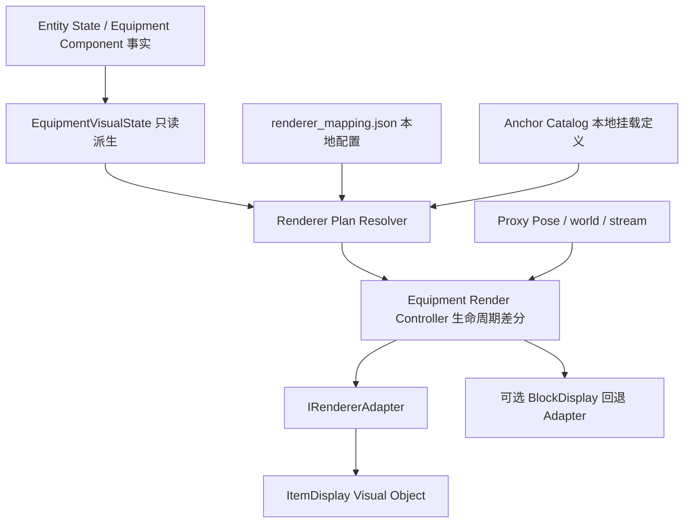

# Phase 3.8.3.0 Renderer Adapter Design

状态：设计文档，未实现。此阶段没有新增 Renderer Runtime、没有修改源码、没有创建模型或资源包。3.8.2.2.1 导航命令修复属于独立任务。

## 1. 架构图与职责



Equipment 是装备事实，EquipmentVisualState 描述装备派生语义，Renderer Plan 描述本地显示意图，Visual Object 是实际游戏显示对象。禁止 Renderer 读取或修改原始 Equipment Component；不得写回 Presentation、Authority、共享 revision 或网络 Component。

现有 ProxyAppearance 是简易 marker 意图，不能表示 ItemDisplay 的物品、挂载及变换。下一代建议采用更完整的 Renderer Plan；ProxyAppearance 保留用于旧 marker 后端和诊断兼容，不作为新系统必须经过的有损中间层。新旧后端通过配置选择，一个实体槽位只允许一个后端拥有可见对象，避免叠加显示。

## 2. 数据流与本地数据结构

1. 同步接收器维护 Entity State，与当前 Runtime 一致。
2. 既有 Generator 生成不可变 EquipmentVisualState，所有五槽保留。
3. Resolver 仅消费该快照及经过验证的本地 mapping，生成每槽 `RenderSpec | null`。
4. Controller 在 Minecraft 客户端线程以完整实体作用域查找 proxy 和当前姿态，差分现有 VisualHandle 与新计划。
5. Adapter 创建、更新或删除 ItemDisplay；其状态不会成为网络事实。

设计数据结构（伪类型，仅文档定义）：

```text
EntityScope = source + world_id + dimension + entity_id + stream_id
Slot = head | body | hands | feet | held_item
RenderSpec = {
  slot, sourceItemId,
  renderer: item_display | block_marker,
  item: Minecraft registry item ID,
  anchor: hand | head_slot | body_slot,
  displayContext: fixed,
  localTransform: translation + rotation + scale,
  fallback: none | block_marker
}
RenderPlan = { slots: Map<Slot, RenderSpec|null>, mappingGeneration }
VisualHandle = opaque adapter-owned object tied to client world and proxy scope
```

`mappingGeneration` 是本地配置世代，不是网络 revision。第一版配置启动加载，不提供热加载；该字段保留未来资源重载区分能力，不发往 Bridge。

`equipment_state=unknown` 或槽为空：计划为空，并清理旧对象。`resolution=resolved`：优先使用兼容的本地 mapping。`resolution=unmapped`：允许根据快照中的 item_id 匹配独立 renderer mapping，否则安全隐藏。现有 EVS 语义目录与未来显示目录独立，不能把未解析的语义误判为不存在的物品。`resolution=incompatible`：隐藏该槽，不绕过既有兼容性判定。所有规则不修改原 EVS。

## 3. Renderer 接口定义

下列接口为设计伪代码，不是可编译 Runtime：

```text
interface IRendererAdapter {
    rendererId(): String
    create(context: RenderContext, spec: RenderSpec): VisualHandle
    update(handle: VisualHandle, context: RenderContext, spec: RenderSpec): UpdateResult
    remove(handle: VisualHandle): void
    clear(scope: EntityScope): void
    clearWorld(worldToken): void
    clearAll(): void
}

RenderContext = immutable scope + clientWorldToken + proxyPose + resolvedAnchorTransform
UpdateResult = updated | recreateRequired | unavailable
```

约束：所有游戏对象操作均在客户端线程；handle 不允许跨 world/stream 使用。remove/clear 必须幂等。Controller 决定差分，Adapter 不查 Equipment，也不发网络消息。create 失败不得留下部分对象；update 失败撤销该对象，其他槽和代理继续运行。失败状态记录原因，不每帧无限重试，仅在装备变化、世界重建或明确资源重新可用时重试。

建议分工：`RendererPlanResolver` 纯数据、`AnchorCatalog` 纯变换、`EquipmentRenderController` 生命周期、`ItemDisplayRendererAdapter` Minecraft API、旧 marker adapter 兼容。不能直接将现有 ProxyAppearanceAdapter 扩展为同时拥有网络事实和游戏实体的类。

本地 Minecraft 1.21.11 映射 jar 只读检查已确认 `DisplayEntity.ItemDisplayEntity` 存在公开的构造器、`setItemStack(ItemStack)` 和 `setItemDisplayContext(ItemDisplayContext)`。这是 API 存在性证据，不是渲染可见性或生命周期已验证的证据。

## 4. 显示类型、Anchor 与 Mapping

第一版使用原版 ItemDisplay + ItemStack，显示原版物品外观。`minecraft:wooden_sword` 是物品注册 ID；`minecraft:item/wooden_sword` 是模型资源表达，不能混作物品注册 ID。配置中统一使用 `item` 字段，避免 `model` 的歧义。以后自定义模型资源另行设计，不在本阶段承诺。

| Equipment 槽 | Anchor | 第一版范围 |
|---|---|---|
| held_item | hand | 显示完整物品，跟随代理刚体姿态 |
| head | head_slot | 显示物品标识，不声称贴合真实玩家头盔 |
| body | body_slot | 定义挂载契约，默认关闭、预留后续验证 |
| hands、feet | 暂无 | 保留数据、计划为 null |

Anchor 相对当前简易代理原点定义，hand 约为侧方/腰部，head_slot 在顶部，body_slot 在躯干中心。anchor 是固定局部坐标，不是骨骼。第一版仅跟随已有代理 yaw/pitch/roll，无走路摆臂、骨骼绑定或第一人称显示。

变换规则：`worldPose × anchorTransform × itemLocalTransform`。缩放仅作用于局部物品，不改基础代理、不改 Presentation.scale。姿态旋转只应用一次，避免 offset 二次旋转。参数范围需要限制，第一版建议 translation 每轴 [-2,2]、rotation 每轴 [-180,180] 度、scale 每轴 [0.05,2]，拒绝 NaN/Infinity。

建议配置 `config/renderer_mapping.json`，此阶段仅有文档示例，不创建运行配置：

```json
{
  "version": 1,
  "enabled": true,
  "default_unknown": "none",
  "mapping": {
    "7dtd:meleeWpnClubT0WoodenClub": {
      "renderer": "item_display",
      "item": "minecraft:wooden_sword",
      "slot": "held_item",
      "anchor": "hand",
      "display_context": "fixed",
      "transform": {"translation": [0,0,0], "rotation": [0,0,0], "scale": [0.5,0.5,0.5]},
      "fallback": "none"
    },
    "7dtd:meleeToolTorch": {
      "renderer": "item_display",
      "item": "minecraft:torch",
      "slot": "held_item",
      "anchor": "hand",
      "display_context": "fixed",
      "fallback": "none"
    },
    "7dtd:meleeToolAxeT1IronFireaxe": {
      "renderer": "item_display",
      "item": "minecraft:iron_axe",
      "slot": "held_item",
      "anchor": "hand",
      "display_context": "fixed",
      "fallback": "none"
    },
    "7dtd:armorPrimitiveHelmet": {
      "renderer": "item_display",
      "item": "minecraft:leather_helmet",
      "slot": "head",
      "anchor": "head_slot",
      "display_context": "fixed",
      "fallback": "none"
    }
  }
}
```

使用采集器真实输出的内部 ID；用户示意的 `7dtd:woodenClub` 可作为显式别名条目，不进行大小写猜测、子串匹配或自动替代。`anchor=held_item` 如需兼容旧文档，只在配置迁移中转换为 hand，不建立第二套隐含运行约定。

配置验证：最多 256 条 mapping、最大 64 KiB；严格布尔/枚举、拒绝重复键和未知字段；slot/anchor 必须匹配；registry item 必须存在且不为 air；缺失 transform 使用显式标准默认值。未知物品默认隐藏，可选回退到已经支持的 marker，但仅在配置明确指定、旧映射也有效时启用。错误配置整体禁用装备渲染并输出一次诊断，不能影响事实同步和基础代理。

## 5. 生命周期规则

| 输入变化 | 本地动作 |
|---|---|
| null → item | 创建一个对象，写物品与局部变换，再加入客户端世界 |
| itemA → itemB | 删除旧对象，再创建新对象；即使映射到同一 Minecraft item 也保留源 ID 的替换语义 |
| item → null | 删除对象、清空槽缓存 |
| 同输入重复生成 | 不重复创建；必要时更新 proxy pose |
| 数量/耐久变化 | 若不影响当前显示计划则保持对象；不引入 Inventory/Combat 语义 |
| 代理移动/旋转 | 更新挂载姿态，不重新生成装备事实 |
| equipment remove/unknown | 清空所有装备对象，保留基础代理和其他组件 |
| entity despawn | 删除该完整 scope 的全部对象及失败记录 |
| disconnect/reset | clearAll，清空 controller、adapter 缓存 |
| world/dimension/stream 改变 | 清理旧 handle，新世界 ready 后从现有快照重新生成 |
| 配置禁用/资源重载失败 | 清理装备对象；基础代理继续运行 |

接收线程不调用 Display API，仅提供不可变派生快照。缓存上限沿用 256 代理，第一版每代理最多两个显示对象。客户端唯一 entity ID 分配需同时考虑代理主体、debug 标签、旧 marker 和新 ItemDisplay，避免多个分配器冲突。

Inspector 应分别显示 RenderPlan（意图）与 Renderer Runtime（实际对象 ID、后端、世界、创建/失败状态）。不得把 mapping resolved、create 日志或 handle 数量直接写成“已可见”；画面可见性必须由游戏人工验收证明。

## 6. 测试方案

| 编号 | 验证目标 |
|---|---|
| 1–4 | club/torch/axe/head 映射为正确 ItemDisplay 计划 |
| 5–7 | 全空、equipment unknown、未知 ID 安全隐藏 |
| 8–9 | EVS unmapped 的显式 renderer mapping 可用；incompatible 禁止绕过 |
| 10–12 | null→item、itemA→itemB、item→null 创建/替换/删除 |
| 13–14 | 重复输入确定性；同模型不同源 ID 不遗留旧对象 |
| 15–17 | despawn、disconnect、world/stream 切换全清理 |
| 18–20 | 手/头 anchor、旋转组合、局部缩放不改变代理或 Presentation |
| 21–23 | 无效 item registry、重复配置键、错误 slot/anchor 安全拒绝 |
| 24–26 | create/update/remove 故障隔离、部分创建回滚、无每帧重试风暴 |
| 27–28 | 256 代理上限与显示 ID 唯一性；长时间切换无缓存增长 |
| 29–30 | 原有 Health/Identity/Presentation/Authority/Equipment/revision 不变；Inspector 区分意图与对象 |

分层验证：Resolver 用纯数据测试；Controller 用可记录对象生命周期的替身；Adapter 必须在真实 Minecraft 中验证 ItemDisplay 出现、物品替换、移除、姿态和清理。原有自动测试 PASS 不能替代真实显示验收。

人工验收时先用 Entity Navigation 命令定位到 7DTD 代理附近，确认区块加载并拍摄相同视角，避免因数百格距离而误判。切换斧头/火把、空手、头盔移除、退出重进；记录帧画面、对象日志及 Inspector 状态。头盔验收仅确认物品对象可见，不验收穿戴拟合。

## 7. 风险与后续决策

- ItemDisplay 的物品 display_context、原版模型固有变换及资源包会影响方向/尺寸，必须实机调整锚点，不能凭 mapping 推断可见。
- 简易刚体代理缺乏真实手/头骨骼，物品标记可能悬浮；这符合第一版范围，不代表真正穿戴装备。
- 客户端本地实体的区块追踪、渲染距离和裁剪可使已创建对象不可见；需要导航定位与运行状态诊断。
- Minecraft 版本更新可能改变 ItemStack/Display API 或物品资源表达，后端必须隔离版本细节。
- 配置错误、资源重载和世界切换可能产生残留对象；所有资源拥有权与清理必须绑定 worldToken + 完整 EntityScope。
- 当前旧 ProxyAppearance 和新 Renderer Plan 并行容易重复渲染；第一版明确只启用一个槽位后端。
- 7DTD 异常断线清理仍依赖既有通知。不得为 Renderer 修改 Bridge/Authority 或自行发明网络 revision。

进入后续实现前需确认：首批仅 held_item/head；body_slot 只预留；ItemDisplay 为原版物品外观；unknown 默认 none；transform 默认 fixed；无需资源包/真实穿戴模型；可见性验收必须在对应远端代理附近进行。

完成本设计后等待指令。禁止直接开始 Phase 3.8.3.1。
