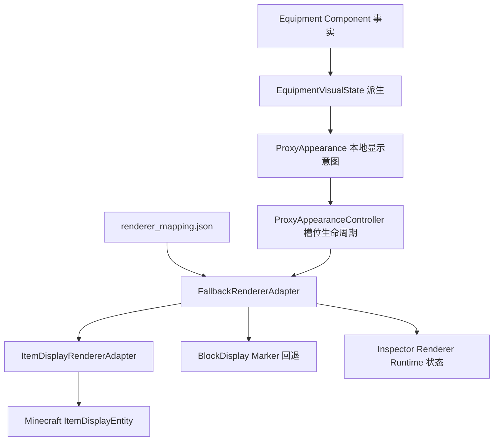

# Phase 3.8.3.1 Renderer Adapter Runtime v1

开发完成；停止在 3.8.3.1，未进入 Phase 3.8.4。只升级 Minecraft 本地 held_item 显示后端。未修改 Equipment 协议、共享 revision、Bridge、7DTD 采集、Authority 或 Presentation Component。

## 实现能力与分层



RendererAdapter 提供 create/update/remove，只接受本地 Context 与 Request。Context 为代理 owner 和姿态，Request 为 ProxyAppearance 的源物品 ID、marker 与已验证配置。Adapter 不读取原始 Equipment，也不发送网络消息。

held_item 首选实际 ItemDisplayEntity：设置 ItemStack、FIXED display context、世界位置、旋转与缩放，再加入 ClientWorld，验证本地实体注册成功。创建失败移除部分对象，然后回退。旧 head 简易 BlockDisplay 标记保持原行为，没有新增护甲模型；body/hands/feet 不创建新 ItemDisplay。

生命周期复用既有 ProxyAppearanceController；只在 Renderer 模式下启用通用 unknown held marker，旧 generate 和旧测试契约不变。传递源 item_id，确保映射为相同 Minecraft item 的不同 7DTD 装备也会删除旧对象再创建。空手/unknown equipment/remove/despawn/disconnect/world 切换均通过原生命周期清理。

## 修改文件列表

项目根目录：`D:\wenjian\minecraft\7-M`。

| 分类 | 文件 | 变更 |
|---|---|---|
| Minecraft | `minecraft-mod/src/main/java/io/mc7dtd/RendererAdapter.java` | 新增本地后端接口 |
| Minecraft | `minecraft-mod/src/main/java/io/mc7dtd/RendererMapping.java` | 新增严格配置读取、held anchor、边界验证 |
| Minecraft | `minecraft-mod/src/main/java/io/mc7dtd/ItemDisplayRendererAdapter.java` | 新增真实 ItemDisplay 后端 |
| Minecraft | `minecraft-mod/src/main/java/io/mc7dtd/FallbackRendererAdapter.java` | 新增自动回退、失败隔离及实际后端状态 |
| Minecraft | `minecraft-mod/src/main/java/io/mc7dtd/ProxyAppearanceAdapter.java` | 增加 Renderer 专用派生入口，未知非空 held item 使用通用 marker |
| Minecraft | `minecraft-mod/src/main/java/io/mc7dtd/ProxyAppearanceController.java` | 传递源物品 ID，增加兼容的 Renderer 模式 |
| Minecraft | `minecraft-mod/src/main/java/io/mc7dtd/MinecraftProxyScene.java` | 绑定两个后端、共用本地 entity ID 分配、回退标记、状态发布 |
| Minecraft | `minecraft-mod/src/main/java/io/mc7dtd/EntityInspector.java` | 增加受限 Renderer 状态缓存与只读输出、清理 |
| Minecraft | `minecraft-mod/src/main/java/io/mc7dtd/MinecraftBridgeMod.java` | 启动加载 renderer mapping |
| Config | `config/renderer_mapping.json` | 新增三种示意 ID 和三种真实采集 ID 映射 |
| Config | `config/renderer_mapping.schema.json` | 新增本地配置 Schema，非 Equipment 协议 |
| Tests | `minecraft-mod/src/test/java/io/mc7dtd/RendererHarness.java` | 新增后端生命周期及回退集成测试 |
| Tests | `tests/run-phase3_8_3_1.ps1` | 新增三端构建与自动测试脚本 |
| Tests | `tests/launch-phase3_8_3_1.ps1` | 新增独立 Phase3831 启动和证据目录 |
| Docs | `docs/entity_debug_inspector.schema.json` | 更新本地诊断输出 Schema，兼容 EVS、ProxyAppearance、Renderer |
| Docs | `docs/phase3_8_3_1_renderer_runtime.md` | 本报告 |

新增 10 个文件、修改 6 个文件，共 16 个。共享 Components 目录本轮没有修改；Health/Identity/Equipment/Presentation 接收器、Authority 和导航命令均未修改。

## 配置与回退

| 源 ID | Minecraft item |
|---|---|
| `7dtd:woodenClub` | `minecraft:wooden_sword` |
| `7dtd:torch` | `minecraft:torch` |
| `7dtd:ironAxe` | `minecraft:iron_axe` |
| `7dtd:meleeWpnClubT0WoodenClub` | `minecraft:wooden_sword` |
| `7dtd:meleeToolTorch` | `minecraft:torch` |
| `7dtd:meleeToolAxeT1IronFireaxe` | `minecraft:iron_axe` |

后三个是当前采集器实际输出的内部名称。配置按 exact item ID 匹配，不靠物品名称子串猜测。石斧、钢斧等未列入 ItemDisplay 映射的装备安全回退到现有 axe marker。

配置对象每条必需 renderer=item_display、item、anchor=held_item。可选 offset(x/y/z)、rotation(x/y/z，度)、scale。默认 offset=(0.55,1.05,0)、rotation=(0,0,0)、scale=0.8；offset 每轴 [-2,2]，rotation 每轴 [-180,180]，scale [0.05,2]。先旋转挂载偏移，再组合物品局部旋转，缩放只作用于物品。

最多 256 映射、64 KiB；拒绝重复 JSON 键、错误类型、未知字段、非有限数值、越界变换和非 held_item anchor。缺失、错误或空配置会使对应非空装备回退到 marker，保持基础实体同步。配置启动加载，需要重启 Minecraft。

缺少 mapping、物品未在 Minecraft registry 注册、物品为空气、ItemDisplay 创建失败：使用 BlockDisplay。club=木板，torch=荧石，axe=铁块，未知装备=橙色混凝土条。ItemDisplay 更新失败也会移除旧对象后尝试回退。若回退自身失败，报告 unavailable，并隔离失败，不影响基础代理。相同失败输入不逐帧反复创建。

`proxy_appearance.json` 既有 enabled 开关仍控制装备表现；关闭时不会创建 ItemDisplay 或回退标记。

## Inspector

```json
{
  "proxy_appearance": {
    "held_marker": "club",
    "head_marker": null,
    "renderer": {
      "type": "item_display",
      "status": "active",
      "renderer_status": "item_display",
      "source_item": "7dtd:meleeWpnClubT0WoodenClub",
      "item": "minecraft:wooden_sword"
    }
  }
}
```

回退输出 type=block_display、status=fallback、renderer_status=fallback_marker，附 reason。两种后端都失败则 status=unavailable。空手或尚未创建输出 renderer=null。该 renderer 状态来自后端生命周期，不由 mapping 是否 resolved 推断。

状态绑定完整 source/world/dimension/entity/stream，最多 256 条，输出深拷贝。despawn、连接不可用、reset/world 切换清理缓存。active 表示后端创建成功，并不等于画面当前在视野中；区块、距离和裁剪仍需人工验证。

## 编译结果

| 项目 | 结果 |
|---|---|
| Minecraft build | PASS，真实 Minecraft 1.21.11 ItemDisplay API 编译通过 |
| Bridge build | PASS，源码未修改，独立 Phase3831 输出 |
| 7DTD build | PASS，源码未修改，独立 Phase3831 输出 |

构建日志位于 `work/phase3831-test/`。未覆盖运行中旧实例的 jar/DLL，未关闭现有游戏/Bridge。

## 自动测试结果

```text
Mapping woodenClub PASS
Mapping torch PASS
Mapping ironAxe PASS
Renderer Create PASS
Renderer Update PASS
Renderer Remove PASS
Renderer Cleanup PASS
Unknown Item fallback_marker PASS
Health PASS
Identity PASS
Equipment PASS
Presentation PASS
Authority PASS
```

Renderer 新增 38 项，既有导航/Goto/Appearance/EVS/组件及 NativeProxy 回归 206 项，共 244 项通过。覆盖真实 API 编译、示意/真实 ID 映射、创建/替换顺序/删除、移动旋转更新、世界切换、despawn、disconnect、peer unavailable、失败回退、无重试风暴、两后端失败隔离、未知物品、仅 held_item 范围、Equipment remove、不同源 ID 同目标物品替换、配置关闭、非法/空配置、组件及 revision 不变、Inspector 只读。

Renderer Mapping Schema PASS；Inspector Schema PASS；启动脚本语法 PASS。27 个现有 Bridge/7DTD/共享组件源文件和工程文件哈希未改变。

自动测试使用实际接收器、Inspector、NativeProxyController、ProxyAppearanceController 和 FallbackRendererAdapter；物理后端为可记录创建/更新/删除的替身。注册物品错误与创建错误通过注入验证回退契约。实际 ItemDisplay 后端已编译，但物品画面可见性尚未实机验收，不能将自动测试 PASS 视为人工画面验收 PASS。

复现：`powershell -File .\tests\run-phase3_8_3_1.ps1`。

## 人工验收步骤

1. 正常保存并退出旧 Minecraft、7DTD 世界和游戏，停止旧 Bridge。确认 proxy_appearance.enabled=true、debug_navigation=true。
2. 在项目目录执行 `./tests/launch-phase3_8_3_1.ps1`。默认启动三端，使用独立 Phase3831 DLL，并复制最新 Minecraft jar。也可分别传 bridge/minecraft/7dtd 参数启动。
3. 进入两个既有测试世界，等待连接和代理生成。
4. Minecraft 执行 `/mc7dtd_entity_list`，复制 7DTD 玩家完整 UUID；执行 `/mc7dtd_entity_goto <UUID>`，靠近青色代理，确认对应区块加载。
5. 7DTD 装备木棒，等待 1–2 秒；Minecraft 在代理侧面应看到原版木剑物品模型。执行 `/mc7dtd_entity_inspect`，记录 renderer=item_display、item=minecraft:wooden_sword、status=active。
6. 7DTD 切换火把，确认木剑模型消失、火把模型出现，日志 Remove 在新 Create 前；可继续测试铁制消防斧显示 iron_axe。
7. 切空手，确认物品模型消失、renderer=null，Health/Identity/Presentation/Authority 仍存在。
8. 正常退出 7DTD 世界，确认 Renderer Remove、代理 despawn 和缓存清理；重新进入、重新 list/goto，确认新的 spawn snapshot 正确生成当前装备，没有旧对象残留。
9. 可选回退验收：备份 renderer_mapping.json，删除木棒对应真实 ID 的条目后重启 Minecraft，装备木棒应显示木板 marker、fallback_marker 和 mapping_missing；完成后恢复配置。此步骤需人工记录，未由本轮自动操作执行。

运行证据目录：`docs/phase3_8_3_1-runtime-evidence/<RunId>/`，含三端进程与 stdout/stderr/game 日志。请同时记录同视角截图；Inspector active 不替代画面证据。

## 已知限制

- 仅 held_item 的原版物品模型；木棒以 wooden_sword 近似显示，没有真实 7DTD 模型或资源包。
- 无护甲模型、身体装备、玩家模型替换、骨骼、动画或第一人称同步。
- 挂载为代理刚体固定偏移；ItemDisplay FIXED context、资源包及代理姿态会影响朝向，实机可通过配置调整旋转/缩放。
- 火把只是显示对象，不提供放置火把或世界照明能力。
- 需要靠近对应 7DTD 代理观察；本地玩家自身没有装备外观变化。
- 断线清理仍依赖现有连接通知；未新增 Bridge 心跳或修改通信。
- 若 Minecraft 删除 API 自身异常，记录移除失败；无故障情况下生命周期覆盖正常清理，无法以 headless 测试保证任意游戏引擎异常下的零残留。

本轮只完成开发与自动验证，未进行 computer-use 或游戏内人工验收。等待下一步指令，不进入 3.8.4。
