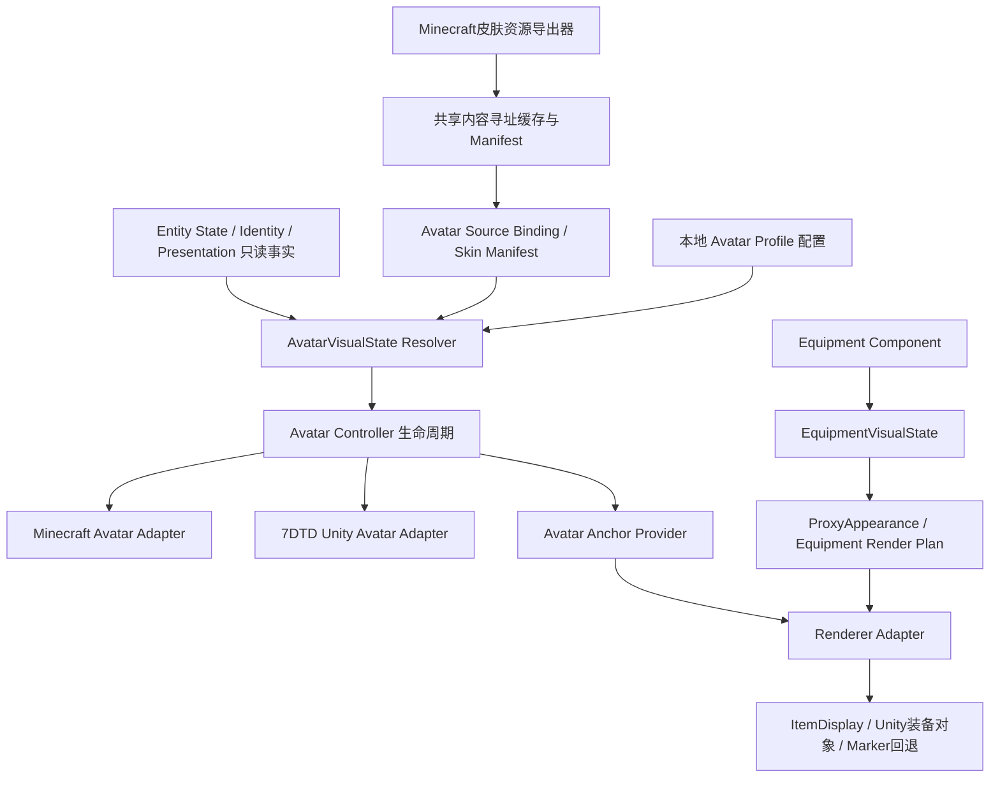

# Phase 3.8.4 Avatar Presentation System Design

状态：设计完成，等待实现指令。仅新增本文档；未修改源码、协议、配置或运行中的游戏，未实现皮肤同步或玩家模型。

## 0. 前置验收与设计范围

用户已确认 Phase 3.8.3.1 人工验收 PASS：ItemDisplay 创建、木棒/火把显示、物品切换、空手移除、实体清理、Fallback 和生命周期管理通过。该结论来源为用户验收反馈，并非本轮重新执行。已知问题：held_item pitch rotation calibration required，纳入本设计的姿态和挂点校准。

本设计涵盖 Minecraft 皮肤资源跨游戏复用、两端玩家外形、身体/头部/手部挂点、与已完成 Equipment Renderer 的关系及 7DTD 显示方案。第一版为静态 Minecraft 风格人形，无骨骼动画、真实 7DTD 玩家换模、Combat/Inventory 或第一人称表现。

皮肤方向明确为 **Minecraft 玩家皮肤 → 7DTD 中的 Minecraft 玩家代理**。7DTD 玩家在 Minecraft 中显示本地配置的默认/指定 Minecraft 风格皮肤；7DTD 原生人物没有可直接视为 Minecraft PNG 的皮肤，不承诺自动转换其原生外观。将某个 Minecraft 账号皮肤绑定到 7DTD 玩家属于显式本地外观配置，不等于该账号的身份或 Authority。

## 1. 当前实现边界

| 现有能力 | 本轮核对结果 |
|---|---|
| Minecraft 代理主体 | 本地青色/金色 BlockDisplay，非真实玩家实体 |
| Minecraft 装备 | held_item ItemDisplay，失败回退 BlockDisplay |
| 7DTD 代理 | UnityMarkerScene 本地 GameObject 方块，禁用 Collider，无 AI/存档实体 |
| Entity ID | PlayerProxyTracker spawn 时生成随机 UUID；不等于 GameProfile UUID |
| Presentation | renderer/model/variant/scale；没有 skin texture 或账号 profile 字段 |
| 姿态 | 现有 rotation 有 yaw/pitch/roll，尚无独立 body_yaw/head_yaw/动画姿态 |

只读检查本地 Minecraft 1.21.11 映射 jar，确认 AbstractClientPlayerEntity.getSkin()、PlayerSkinProvider.fetchSkinTextures(GameProfile)、SkinTextures.body()/model() 存在。SkinTextures 使用 TextureAsset 和 PlayerSkinType；不能沿用旧版本字符串 skin model API 假设。**这些 API 的存在不代表已获取 PNG 字节**：原图读取、缓存访问及纹理线程约束需在实现前单独 API Research。

当前没有跨游戏皮肤资产传输。仅凭现有 Entity/Identity/Presentation 数据无法可靠推导玩家皮肤，也不能用 display name 或随机代理 UUID 查询账号皮肤。

## 2. 架构与数据流



事实层拥有同步数据；AvatarVisualState 是本地派生外观；Avatar Adapter 拥有身体显示对象；Renderer Adapter 拥有装备显示对象。Anchor Provider 是两者之间的几何契约。

Avatar 不读取或修改原始 Equipment；装备仍通过 EquipmentVisualState 派生。Renderer 不拥有 avatar 根节点，也不改 Presentation Component。皮肤更换不改变 Health、Identity、Equipment、Authority 或共享 revision。

资源路径：获取/验证皮肤 → 内容哈希缓存 → 绑定完整代理 scope → AvatarVisualState → 主线程创建/更新头像。实体不等待皮肤下载，先显示默认头像，资源就绪后替换材质。装备显示不等待皮肤资源就绪，只需要有效挂点；头像失败时使用旧代理及旧挂点。

## 3. Minecraft 皮肤同步方案

### 3.1 第一版：当前同机部署的共享本地资产

两游戏当前运行在同一机器，建议第一版使用共享磁盘缓存，不新增 Bridge 消息，不把 PNG/base64 放入 Entity Component：

```text
Minecraft source skin observation
→ skin pixels resolver（后续 API Research 验证）
→ PNG 校验/标准化
→ assets/avatar/skins/<sha256>.png
→ assets/avatar/manifests/<scope-hash>.json
→ 7DTD 本地 SkinAssetResolver
→ Unity 材质/人形代理
```

这些目录为设计建议，本阶段未创建。皮肤自动导出/manifest 自动更新尚未实现；不能把现有手动 PNG 配置称为已完成自动同步。

将 source 身份与 proxy 身份分离：

```text
AvatarSourceBinding {
  proxyScope: source/world/dimension/entity_id/stream_id,
  profileUuid: Minecraft GameProfile UUID（可选，仅来源端可确认）,
  skinHash,
  modelVariant: classic | slim,
  localAssetGeneration,
  exportedAt,
  sessionActive
}
```

Minecraft 来源端通过未来只读 scope observer 关联“实际发送成功的 proxy scope”和当前 client.player profile，不能重新生成一套 Entity ID，也不能把实体 ID 当账号 ID。账号 UUID 只是皮肤来源标识，不是跨游戏 Authority。

导出 PNG 先写临时文件并验证，再原子替换；完成后发布 manifest。接收器必须先验证 scope、session、哈希及格式，再应用。manifest 晚到但 scope 已 despawn/换 stream 时丢弃；断线标记 session inactive，运行态回退/清理，不让旧 manifest 激活新实体。

localAssetGeneration 是本地资源世代，只用于阻止异步旧结果覆盖新皮肤，不修改 Equipment 的 revision 或 Entity sequence。不按每个位置更新重复导出；来源纹理哈希/模型变体变化才产生新资产。内容缓存跨实体复用，运行句柄按 scope 隔离。

### 3.2 模型与纹理约束

- 第一版接收 64×64 PNG，支持 classic（4 像素宽手臂）与 slim（3 像素宽手臂）；模型变体必须显式记录，不能单凭透明像素猜测。
- 旧 64×32 skin 暂不接受；可单独设计明确的标准化转换后再加入支持。大尺寸/自定义高分辨率皮肤暂不支持。
- 帽子、外套、袖口、裤腿等 overlay 层作为可选静态外层，默认与基础层分开 Mesh，避免错误透明度破坏基础身体。
- Cape、Elytra、动态皮肤、第一人称手臂和账号认证信息不在范围。
- skinHash 按最终解码验证并使用的 PNG 字节计算，不能把 URL 字符串当资源版本。下载失败时保留最后有效缓存或默认皮肤，不能阻断实体同步。
- PNG 字节上限建议 256 KiB、尺寸白名单、固定缓存根目录、按哈希命名、拒绝路径穿越。Unity 与 Minecraft 动态纹理的释放、缓存引用计数必须明确。

不将任意远端 URL 当下载指令，不同步 access token、cookie 或登录凭据。Minecraft 来源皮肤使用来源端已获取的可信皮肤资源；接收端只读经过校验的缓存文件。

### 3.3 多机部署边界

共享磁盘方案只满足当前同机部署。多机自动同步必须另行设计资源传输能力：SkinDescriptor/Asset Manifest 的传递、哈希寻址下载、资源大小限额、失效与重试、来源校验及协议兼容。可以评估独立资源通道，不能宣称当前 Bridge 自动提供这些能力。

现有 Presentation Schema 不允许任意 skin/profile 字段。若未来把 skin reference 纳入 Presentation 或新增 Avatar Component，必须单独批准协议设计与迁移；本设计不在 renderer/model/variant 中塞入 URL、JSON 或资源数据来绕过 Schema。

## 4. 玩家模型表示

### 4.1 通用 AvatarVisualState

以下是设计数据结构，不是新增网络 Component：

```text
AvatarVisualState {
  scope,
  avatarKind: minecraft_humanoid | default_humanoid | marker,
  modelVariant: classic | slim,
  skin: {hash, localAssetRef, readiness: pending|ready|fallback},
  effectiveScale,
  posePolicy: body_yaw_head_pitch,
  anchors: canonical anchor set,
  resourceGeneration
}
```

effectiveScale 从有效 Presentation.scale 只读派生，缺失用 1；本地模型固有尺寸和装备缩放各自独立。第一版约定 Minecraft 风格人体高度约 1.8 Minecraft 单位；7DTD 单位变化应经过现有 CoordinateMapper 的统一长度换算，不在模型或装备代码中再叠加坐标转换。

### 4.2 Minecraft 端模型后端

建议专用的本地 AvatarRenderProxy + 渲染后端，复用 Minecraft 风格模型/皮肤布局，保持独立于真实客户端玩家、tab list 和游戏服务器玩家实体。**不采用伪造玩家入服/账号身份作为头像创建方案**。

是否以自定义客户端实体承载，或在现有代理生命周期中单独提交模型渲染，需在 API Research 后选择；本设计不假定跨本地 ClientWorld 注册自定义玩家模型已可行。要求：不添加碰撞、AI、Combat、Inventory 或真实 PlayerEntity 权限。

迁移时先创建新模型成功，再隐藏旧青色主体；失败保留旧代理。模型切换不得重置 Entity scope 或丢失装备对象。新模型可用时原旧主体隐藏，不能同时显示两个完整身体。

### 4.3 7DTD 端方案

推荐 **Unity 本地 Minecraft 风格六部件模型**，而非修改原生玩家或生成 EntityAlive：

```text
AvatarRoot（代理位置 + 身体yaw + 基础scale）
├ Body（8×12×4像素比例）
├ HeadPivot → Head（8×8×8）+ 可选帽层
├ LeftArmPivot → LeftArm（classic 4×12×4 / slim 3×12×4）
├ RightArmPivot → RightArm
├ LeftLegPivot → LeftLeg（4×12×4）
└ RightLegPivot → RightLeg
```

像素比例用于模型相对尺寸；按统一人体高度归一化，不能直接把每个像素当一个 Unity 米。Mesh 使用 Minecraft skin UV atlas 和明确的 classic/slim 模板。纹理使用 point filtering，禁用重复平铺；基础层与透明 overlay 分开处理，材质优先复用当前可用 unlit 方案，shader 不可用时回退默认材质/方块。

Unity cube primitive 默认 UV 不符合 Minecraft skin atlas，因此不能只给当前方块换一张 skin PNG 就声称完整人形正确。需明确制作面 UV、镜像/背面方向、pivot 与贴图朝向。

Unity GameObject/Texture2D/Mesh/Material 创建及释放只在 7DTD 主线程执行。下载/文件 IO 可异步，完成通知回主线程；不得让 socket worker 调 Unity API。去除 Collider/Rigidbody，不关联实体 AI、存档或网络 Authority。

继续使用当前世界原点约定：`Unity world position = mapped 7DTD position - Origin.position`。浮动原点变化需要刷新根节点位置；不能给皮肤和装备分别减一次 Origin。

7DTD 本阶段设计只保证 Minecraft 来源玩家的 Avatar 外观；当前没有 Minecraft→7DTD 装备同步闭环，不能仅凭挂点定义承诺该方向装备也已同步。未来若已有合法 EquipmentVisualState 输入，Unity 装备 Renderer 才接入对应挂点。

## 5. 身体、头部、手部挂点与 pitch 校准

定义统一语义名称，由每端 Avatar Adapter 解析为本地变换：

| Anchor | 所属局部空间 | 用途 |
|---|---|---|
| body | 身体根部空间 | 未来胸部/背部视觉，不实现护甲逻辑 |
| head | HeadPivot 空间 | 头部视觉挂点，跟随视线 pitch |
| hand_right | RightArmPivot/手掌空间 | 第一版 held_item 默认右手 |
| hand_left | LeftArmPivot/手掌空间 | 保留，不新增左右手控制协议 |
| held_item | hand_right 兼容别名 | 兼容当前 renderer_mapping.json |

挂点模型依赖 classic/slim 手臂宽度，具体偏移在本地配置 profile 中分别定义。下列为概念示例，坐标值需实机校准，不直接写成固定实现：

```json
{
  "avatar_kind": "minecraft_humanoid",
  "model_variant": "classic",
  "pose_policy": "body_yaw_head_pitch",
  "anchors": {
    "body": {"parent":"root","offset":[0,0.9,0]},
    "head": {"parent":"head_pivot","offset":[0,0,0]},
    "hand_right": {"parent":"right_arm_pivot","offset":[0,-0.6,0]},
    "hand_left": {"parent":"left_arm_pivot","offset":[0,-0.6,0]}
  },
  "aliases": {"held_item":"hand_right"}
}
```

### 5.1 第一版姿态规则

现有 yaw 没有身体/头部拆分，第一版将 yaw 同时用作身体朝向与头部朝向；pitch 只控制头部视线，身体保持直立。远端 player roll 默认不应用到身体，除非未来明确增加可配置姿态政策。不得直接把现有整个 yaw/pitch/roll Quaternion 复制到所有身体部件。

静态手臂/手掌默认随身体 yaw，**held_item 不额外继承头部 pitch**。需要瞄准/举手姿态的装备属于后续 pose/animation 设计，本阶段不猜测。当前 pitch 校准问题不能仅靠为每个物品添加固定 rotation.x 抵消，因为输入 pitch 是动态值。

### 5.2 挂点变换契约

`T_visual = T_proxyRoot × T_bodyPose × T_anchorLocal × T_itemCalibration`

头部对象使用 HeadPivot 的额外 pitch；手持对象使用 hand anchor 的姿态。Quaternion 乘法顺序、Minecraft yaw 符号和 Unity 坐标系转换由各端 adapter 统一处理。anchor offset 只能旋转一次，scale 只能在约定的层级乘一次。

Anchor Provider 返回的 Pose 明确是世界空间还是相对根空间；建议给 Renderer 返回世界挂点矩阵，Renderer 仅附加物品局部校准，不再次施加 entity yaw/pitch。Unity 子节点若已通过 parent 获得姿态，则只能写 localTransform，不能再写同一份世界旋转。

当前 3.8.3.1 offset=(0.55,1.05,0) 是代理根空间偏移；迁移到手掌空间后不能原样相加，否则产生双重偏移。建议配置定义 `transform_space=proxy_root|anchor_local`，旧配置明确按 proxy_root 兼容，新 profile 采用 anchor_local；不静默改变现有配置语义。

## 6. 与 Equipment Renderer 的关系

职责边界：Avatar Controller 负责身体、皮肤和 Anchor Provider；Equipment Renderer 负责装备对象 create/update/remove；事实层负责同步数据。模型可变化，EquipmentVisualState 不需跟着修改。

设计接口（伪代码，仅文档）：

```text
AvatarAdapter {
  create(scope, avatarVisualState, proxyPose) -> AvatarHandle
  update(handle, avatarVisualState, proxyPose)
  anchors(handle) -> AvatarAnchorProvider
  remove(handle)
}

AvatarAnchorProvider {
  resolve(anchorName, framePose) -> WorldAnchorPose | missing
}

SkinAssetResolver {
  request(binding, generation) -> async ValidatedSkinAsset | fallback
  release(assetHandle)
}
```

Avatar 或 skin 更新时优先保留装备对象，只更新其挂点；若旧 Avatar handle 被销毁，先使装备脱离旧挂点/删除，再删除头像，避免悬空引用。姿态/材质更新不推进网络 revision。body/head anchor 的存在只是能力预留，不等于实现护甲模型。

回退链：皮肤失败→默认皮肤；模型失败→现有方块代理；anchor 缺失→旧 proxy_root 挂点；装备 ItemDisplay 失败→既有 BlockDisplay marker。每级回退独立，避免皮肤失败清空 Health 或装备事实。状态必须报告具体失败层，不把资产下载成功当作模型已可见。

## 7. 生命周期与资源拥有权

| 事件 | 动作 |
|---|---|
| spawn | 创建默认 avatar，异步请求 skin；绑定 scope 和 generation |
| skin 就绪 | 确认 scope、worldToken、generation 仍有效，再替换材质 |
| skin/profile 改变 | 请求新资源，保留旧有效资源至新资源可用 |
| classic/slim 改变 | 重建对应几何和 anchors，保证装备不引用旧挂点 |
| 装备变化 | 只由既有 Equipment Renderer 处理，不重建 skin |
| 身体移动/视线变化 | 更新根与头部姿态，装备仅跟随指定挂点 |
| despawn | 先清装备挂点引用，再清 Avatar、取消请求、释放纹理引用 |
| disconnect/world/stream 更换 | 旧 scope 所有运行资源清理；晚到异步结果忽略 |
| 7DTD Origin 变化 | 重定位 root，子节点不重复换算 |
| 资源/配置重载失败 | 保留最后有效状态或进入明确回退，事实同步继续 |

建议沿用最多 256 个 avatar；磁盘缓存先设 128 个 skin/32 MiB，内存采用引用计数和 LRU，活跃引用不淘汰。相同 skinHash 可共享 texture，不共享实体 scope 或可变材质实例。Unity Mesh/Material 的共享与销毁责任需分别定义，避免删除一个代理导致其他代理材质失效。

Inspector 应区分 avatar_kind/model_variant、skin_hash、asset pending/ready/fallback、model active/fallback/unavailable、anchor 来源和 Equipment renderer_status，并显示当前 scope 和本地 asset generation。不得将 ready 与真实画面可见性合并为同一个 PASS。

## 8. 验证方案

### 自动测试

1. 随机 Entity ID 与 GameProfile UUID 分离，绑定不串玩家。
2. 64×64 PNG 有效/损坏/超限/不支持尺寸验证。
3. classic/slim 几何与 UV 模板选择、左右手面方向。
4. hash 不匹配、重复导出、原子写入中断不会替换有效资源。
5. manifest 旧 stream/错误 world/generation 晚到均拒绝。
6. skin 下载失败、模型失败、anchor 缺失分别触发正确回退。
7. 两代理共享皮肤缓存，删除一个不影响另一个。
8. spawn/update/despawn/disconnect/world 切换取消异步请求并清理。
9. 装备切换不重建 avatar；换皮肤不修改 Equipment/revision。
10. head pitch 变化、身体直立、静态 held_item 不误随头部 pitch。
11. yaw=0/90/180/270、pitch=-90/-45/0/45/90、scale=0.5/1/2 的变换矩阵组合。
12. 旧 proxy_root 配置与新 anchor_local 配置均无重复偏移/旋转。
13. Unity Origin 变化后身体/皮肤/装备相对位置一致。
14. Health/Identity/Presentation/Authority 原值、事件顺序和协议保持。
15. Avatar/纹理/材质数量上限、长期进出世界无缓存增长。

### 人工验收

使用有明显正反、左右手标识的测试皮肤；分别验证 classic/slim、基础层/overlay。Minecraft 与 7DTD 同时查看 Minecraft 玩家代理，确认皮肤对应且方向一致。定位到远端代理附近，执行木棒→火把→空手，检查既有 Renderer 行为未回归。

pitch 校准必须以固定位置/固定相机的矩阵测试截图验证：身体应直立、头部随视线、手持不会围绕人体根点异常转动。换皮肤、断线、退出重进和资源失效后，检查回退及残留对象。Inspector 与日志作为辅助证据，画面另行记录。

## 9. 分阶段实施建议与待确认项

建议拆分，逐阶段验收后再推进：

1. **Avatar/Skin API Research**：确认 1.21.11 皮肤像素读取、Minecraft 本地模型渲染入口、Unity Mesh/UV/材质版本、classic/slim 和线程释放规则，不写 Runtime。
2. **Avatar Anchor & Pitch Calibration**：先独立统一根/头/手姿态与旧配置兼容，修复已知 pitch 问题；不依赖皮肤资产传输。
3. **Default Avatar Runtime**：两端默认静态人形、Anchor Provider 与旧代理回退，先不读取在线账号皮肤。
4. **Local Skin Export/Binding**：同机共享内容缓存、完整 scope manifest、异步失效及默认皮肤回退。
5. **Equipment Renderer Integration**：迁移到实际手部 anchor，回归已通过的 3.8.3.1 生命周期；不新增护甲/动画。
6. **Multi-host Skin Asset Design**：仅在部署需要时另行设计资源通道和协议兼容。

实现前需确认：同机皮肤资源方案是否作为 v1；classic+slim 是否都纳入首轮；overlay 是否首轮启用；7DTD→Minecraft 默认皮肤如何配置；是否接受静态人形与右手默认；多人/多机支持是否另立任务。当前设计建议同机、classic+slim、overlay 可选、右手静态挂载、多机后置。

以上为建议任务拆分，不表示已授权或开始对应实现。完成设计后停止，等待下一步指令。
