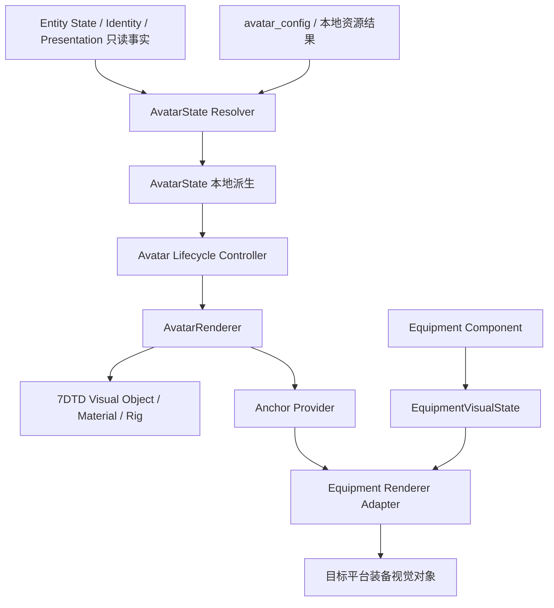

# Phase 3.8.5.0 Avatar Renderer Architecture Design

状态：架构设计与只读 API 调查完成。未实现 Avatar Runtime、模型、动画同步、多人 Skin 获取；未修改 Entity/Equipment 协议或现有源代码。本阶段不将设计测试标为已通过。

## 1. 结论与证据等级

优先调查原生方案 A 的要求已执行。**原生模型与动画入口存在，但独立纯视觉复用、实际 Humanoid Avatar、Minecraft 皮肤 UV 适配及动画可用性仍需受控验证**。不能把方法存在当作模型复用成功。

当前安装版为 **7DTD V3.2.0 b10，Unity 2022.3.62f2**。证据来自当前项目验收日志 `docs/phase3_8_3_1-runtime-evidence/20261004-131316/7dtd-game.log`，不是推测其他版本 API。

| 调查问题 | 当前结论 | 证据/限制 |
|---|---|---|
| 原生玩家 Humanoid 是否可复用 | 找到候选 SDCS 模型入口；未证实可独立复用 | entityclasses.xml 与 Assembly-CSharp metadata，未实例化模型 |
| Mod 是否可动态替换代理模型 | 项目拥有本地 GameObject 生命周期，可设计替换自有代理；原生玩家模型切换存在入口 | 现有 UnityPlayerProxyScene 创建/删除，AvatarController.SwitchModelAndView；不等于安全替换真实玩家 |
| Unity 是否可运行时加载 PNG | 是，当前安装程序集含 public ImageConversion.LoadImage 重载 | API 存在与官方文档确认；没有本轮 GPU/材质实测 |
| Alex Slim UV 转换 | B 可使用专用 slim UV/几何模板；A 必须针对具体原生 Mesh 制作映射 | 不存在已确认的通用 Minecraft PNG→SDCS 自动转换 |
| 动画兼容 | Humanoid retargeting 需有效 Humanoid Avatar；7DTD Controller 可能依赖 Entity 与专属骨架路径 | 有 Animator/Avatar API，实际 rig/controller/clip 类型仍待验证 |

特别修正此前粗略描述：7DTD 当前 Minecraft 玩家代理不是单个方块，而是 `UnityPlayerProxyScene` 创建的五部件橙色几何人形（body/head/nose/两腿），无 Animator/装备；通用 marker 才使用 UnityMarkerScene 方块。

## 2. AvatarState 与分层架构



`avatar_state` 采用用户提出的语义结构：

```json
{
  "source":"minecraft",
  "model":"minecraft_humanoid",
  "variant":"alex_slim",
  "skin":"skins/player_default.png"
}
```

此处“Avatar Component”是 **Minecraft 玩家代理的本地派生状态**，不注册为网络 Component、不加入 Entity 消息、不新增共享 revision。source 来自合法 Entity source；model/variant/skin 来自本地 Avatar 配置及已验证资源结果，不读取网络中的任意资源路径。

运行控制上下文单独携带完整 EntityScope（source/world/dimension/entity_id/stream_id）、worldToken、proxyPose 和 resourceGeneration。skin 请求路径与最终解析资源分开：fallback 时实际资源来自默认文件或内置资源，Inspector 不能继续声称请求皮肤已加载。

Identity 表示身份事实，不直接驱动模型对象；当前随机代理 UUID 不是 Minecraft GameProfile UUID，也不用于账号皮肤查询。第一版按 source=minecraft 与本地默认配置解析外观，不依赖姓名匹配或新增皮肤服务器。

Avatar 负责身体、头部、皮肤、模型与挂点。Equipment 负责武器及挂载物；任何 Avatar 更新都不得改变 Equipment、Health、Identity、Presentation、Authority。装备快照也不能直接调用 Avatar Mesh/Material。

## 3. 7DTD 方案 A：原生 SDCS 人形调查

### 3.1 本地安装证据

`Data/Config/entityclasses.xml` 的 playerMale 配置为：Class=EntityPlayer、ModelType=SDCS、PhysicsBody=PlayerSDCS、AvatarController=AvatarSDCSController、Prefab=Player，并另有 LocalAvatarController。该证据表明当前玩家路线为 SDCS，不能直接套用旧 UMA 玩家教程。安装中仍存在 AvatarUMAController，不能据此断言当前玩家使用 UMA。

使用 System.Reflection.Metadata 读取安装 DLL 的类型/方法表，没有加载 Unity 场景或执行这些方法：

| 类型/入口 | 确认内容 | 使用边界 |
|---|---|---|
| AvatarController.SwitchModelAndView | public virtual，3 参数 | 参数与初始化契约、Entity 依赖未动态验证 |
| AvatarController.GetActiveModelRoot | public abstract，0 参数；子类存在实现 | 可作为研究模型根节点入口，不直接视为外部稳定 API |
| AvatarSDCSController.SwitchModelAndView | public override，3 参数 | native player controller，不是项目现有被动代理接口 |
| SDCSUtils.CreateVizTP | public static，5 参数 | 参数名为 _archetype、baseRig、boneCatalog、entity、isFPV |
| SDCSUtils.UnloadViz | public static，1 参数 | 原生资产拥有权可能必须配套，不能全部用 Destroy 替代 |
| SDCSUtils.TPAnimController | public getter | Controller 资源存在入口，实际参数/clip/Avatar 兼容仍待验证 |
| Animator.avatar/runtimeAnimatorController/GetBoneTransform | 安装 Unity AnimationModule 中存在 | 实际模型是否有有效 Humanoid Avatar 未验证 |

SDCSUtils 的 baseRig/boneCatalog 是引用参数的签名证据，entity 参数说明该路线至少存在游戏实体上下文耦合；是否允许 null 或脱离 EntityAlive 使用未确认。研究候选不代表应创建原生 EntityPlayer 来承载跨游戏代理。

### 3.2 原生方案的执行思路（仅设计）

模型解析器定位合法第三人称 SDCS 资源 → 评估是否可创建独立 visual instance → 验证 rig/Animator/材质槽 → 分离游戏行为脚本、物理、第一人称对象及事件 → 保留 visual root 与必要动画组件 → 应用转换后的皮肤材质 → 接入项目 AvatarRenderer。

这条路线必须通过三个关口：

1. **隔离关口**：不创建真实玩家、不注册网络 Entity、不带 AI/碰撞/存档，不需要伪造 Authority。
2. **皮肤关口**：拿到对应 Mesh 的 UV/材质布局，形成可重复的 conversion profile，而非直接覆盖一张 PNG。
3. **动画关口**：确认 Avatar.isValid/isHuman、clip 类型、controller 参数、依赖脚本和事件；不因载入 controller 导致伤害/声音/位移等游戏副作用。

上述任何一项不能成立，A 暂停；保留原代理并转向 B 的可绑定骨架方案，不为“复用骨骼”破坏事实层和被动代理约束。

### 3.3 优点与风险

原生资源可能提供现成骨架、第三人称 Controller 和手部节点，有利于后续行走、战斗显示。但原生人的比例和曲面不能天然呈现 Minecraft 方块角色；换肤只能改变材质，不能把原生 Mesh 变成 Alex 的几何。

UV、材质多槽、SDCS 组合部件、角色变体、骨架初始化、游戏行为脚本与资产释放存在耦合。模型方法在新版本变化也可能破坏兼容。因此当前判定是 **研究优先级高，实施可行性未证实**，不是“A 已可直接实现”。

## 4. 方案 B：自定义 Minecraft Humanoid

使用项目自有 Minecraft 风格 Mesh、classic/slim 几何与标准 skin atlas；第一阶段可静态显示，后续资源可明确制作骨架并配置 Unity Humanoid Avatar。**B 不必永久无骨骼**，缺少现成动画与“不可能支持动画”不同。

几何模板分别定义 Alex 3 像素宽手臂、Steve 4 像素宽手臂及各部件 UV。模型资源需准备，当前 assets/avatar/models 只有占位，没有可解析模型，因此 Model Resolve 尚不能实际 PASS。

如果原生 A 无法隔离，而原生动画经验证是可用 Humanoid clip，可评估“自有 Minecraft Mesh + 自有 Humanoid rig + 合法可用动画 retargeting”的 B 路线。若 clip 是 Generic、绑定原生 transform 路径，不能承诺通过 Avatar 自动重定向。[Unity Humanoid 重定向文档](https://docs.unity3d.com/2022.3/Documentation/Manual/Retargeting.html)

| 比较项 | A 原生模型 | B 自有 Minecraft 模型 |
|---|---|---|
| Minecraft 轮廓还原 | 原生曲面比例，有限 | 高，可按 classic/slim 几何控制 |
| PNG atlas | 需专属 UV 转换 | 使用已定义模板 |
| 骨骼/动画 | 有候选入口，未证明独立兼容 | 需准备 rig/Avatar，之后可研究 retargeting |
| 被动视觉隔离 | 较高风险 | 自有对象可控 |
| 资源准备 | 原生资产定位/依赖调查 | 需要 Mesh/rig/资源构建流程 |
| 首阶段决定 | 优先受控研究，满足关口才实施 | A 不成立时保底；骨架目标不放弃 |

后续 NPC 的 AI、Combat 与网络 Authority 不是骨骼提供的功能，不能通过引入原生人形 controller 自动获得；需独立系统设计。

## 5. Skin Parser 与 UV 方案

### 5.1 输入与当前差距

目标设计支持 64×64 与 128×128 方形 PNG，variant 显式为 alex_slim 或 steve_classic。当前 3.8.4.1 AvatarResources **只接受 64×64**，128×128 是待实现的资源解析扩展，本轮没有修改其验证器。

PNG → 文件大小/签名/尺寸/完整解码校验 → SkinDescriptor → 选 variant UV 模板 → 目标 backend UV 处理 → Unity Texture2D → 实例材质。

采用规范化 UV：`u=pixelX/width`，`v=1-pixelY/height`，根据 UV 模板坐标原点统一翻转一次。128×128 使用与 64×64 相同的 atlas 分区比例，逻辑像素坐标乘 2，再除 128；保留高清像素，不强制缩成 64。两种尺寸白名单，不扩展至任意图片尺寸。

### 5.2 Alex Slim

Slim 必须同时改变手臂宽度、对应侧面 UV 宽度、局部 pivot/hand anchor；仅修改 variant 字符串或缩放整个模型不能实现正确 Alex。

B 使用独立 slim UV/几何模板，左右臂/腿分别定义，外层 sleeve、hat、jacket、pants 分开处理。模板以标识前后左右面的测试 skin 校验，不根据空白像素自动猜 variant。

A 不能直接沿用 B 的立方体六面 UV。需要针对特定 SDCS mesh/material slot 定义 conversion profile，例如将 Minecraft 对应部位采样/烘焙到目标 mesh atlas。转换模板应绑定 model/mesh fingerprint、variant、材质槽版本。若只能定位粗略身体区域，可提供明确的近似显示，但不能标为像素准确还原。原生手臂宽度不是 3 像素时，材质转换也无法产生 slim 几何。

具体 SDCS UV atlas 尚未读取，当前未生成转换模板；UV 转换仍是 A 的阻塞条件。不能假设一种 profile 适用于全部原生玩家变体与衣物。

### 5.3 Unity 纹理与材质

当前 UnityEngine.ImageConversionModule.dll 确认含 public LoadImage(Texture2D, byte[]) 和三参数重载，官方文档确认该 API 能从 PNG 字节载入纹理并返回成功状态。[Unity 2022.3 LoadImage](https://docs.unity3d.com/2022.3/Documentation/ScriptReference/ImageConversion.LoadImage.html)

设计为后台读取/校验文件，7DTD 主线程创建 Texture2D、执行 LoadImage、设置 point filtering/clamp 和材质。原始 skin 按颜色贴图处理，避免错误 linear/sRGB 导致肤色变化。基础层与透明 overlay 使用独立材质策略，避免整个人体意外透明。

不修改共享原生材质；实例材质或受控属性覆盖由 Avatar handle 拥有。Texture/Mesh/Material 使用引用计数、失败回滚与明确释放。项目 csproj 当前没有 ImageConversionModule/AnimationModule 的显式引用，未来实现需按实际使用添加引用；本轮未改工程。

无网络下载、账号 token 或多人 Skin 服务器。本地路径保持资源根约束与回退：请求皮肤 → 默认文件 → 本地可用内置默认资源 → 旧几何代理。Minecraft jar 内的默认 PNG 不能被假定为 7DTD 可直接读取的内置资源，C# 端需明确自己的默认资源包或共享文件路径。

## 6. AvatarRenderer 接口与平台后端

接口为伪代码，不是 Runtime 实现：

```text
AvatarRenderer {
  createAvatar(context, avatarState) -> AvatarHandle
  updateAvatar(handle, avatarState, proxyPose) -> updated | rebuild | fallback
  removeAvatar(handle)
  clearWorld(worldToken)
  clearAll()
}

AvatarContext = scope + worldToken + resourceGeneration
AvatarHandle = visualRoot + modelHandle + skinRefs + materialRefs + anchors + status
```

输入由 AvatarState Resolver 提供，不让 Entity receiver 直接调用模型 API。游戏线程是唯一显示对象拥有者；异步完成结果必须检查 scope/worldToken/generation。

`RendererAdapter` 表示平台适配契约，不等于目前 Java 接口可以原样运行在 C#：

```text
Renderer Adapter 平台门面
├ AvatarRenderer → Unity Character Visual（本阶段设计）
├ EquipmentRenderer
│  ├ Minecraft backend → ItemDisplay（现有）
│  └ 7DTD backend → Unity挂载对象（尚未实现）
└ EffectRenderer → 后续独立设计
```

ItemDisplayEntity 是 Minecraft API，不能在 7DTD Unity 世界中实例化。当前 Equipment 同步闭环为 7DTD→Minecraft，不能把 Minecraft→7DTD 装备兼容设计写成已有该方向同步；此处仅保证接口分离和挂点契约。

AnchorProvider 定义 body/head/hand_right/hand_left，held_item 为默认右手别名。有有效 Humanoid Avatar 时可研究 Animator.GetBoneTransform；无有效 Avatar 时使用经过确认的显式路径模板或回退旧代理挂点。该 API 对空/无效/非 Humanoid Avatar 会抛出异常，不能无条件调用。[Unity GetBoneTransform](https://docs.unity3d.com/2022.3/Documentation/ScriptReference/Animator.GetBoneTransform.html)

身体采用 yaw，头部应用 pitch；静态手持默认不额外继承头部 pitch。根矩阵、骨骼/anchor 与物品局部校准只乘一次。延续 3.8.4 已记录的 pitch 校准任务，但本轮不修复 Runtime。

## 7. 生命周期与 Inspector

| 事件 | Avatar 生命周期 |
|---|---|
| spawn | 解析本地配置、创建默认/回退视觉，异步请求 skin；记录完整 scope |
| skin 更新 | 新纹理校验成功后原子替换实例材质，释放旧引用；失败保留最后有效资源 |
| model/variant 更新 | 先创建并验证新 model，再切换；装备先解除旧 anchor 引用，失败保留旧对象 |
| pose 更新 | 在游戏线程更新位置/yaw/head pitch；不重载 skin |
| remove/despawn | 清装备引用，停止视觉活动，再释放 avatar/model/material/skin 引用 |
| disconnect/world/stream 改变 | clearAll/clearWorld，忽略晚到异步结果，清状态缓存 |
| Origin.position 改变 | 根对象统一减当前世界原点；子节点不重复换算 |

原生 SDCS owned assets 使用配套释放规则，自有 GameObject/Texture/Material 使用各自生命周期，不擅自销毁共享原生 Mesh 或 controller。Unity Destroy 是延迟销毁，先禁用显示，再在安全主线程释放引用。

Inspector 设计示例：

```json
{
  "avatar_renderer": {
    "type":"humanoid",
    "backend":"sdcs_native",
    "variant":"alex_slim",
    "skin":"player_default.png",
    "status":"active",
    "resource_status":"ready"
  }
}
```

type=humanoid 是显示分类，不证明 Animator.avatar.isHuman。另行诊断 rig_valid/rig_is_human、实际 model handle 和 skin hash。配置模型为 minecraft_humanoid、后端 sdcs_native 只表示“按本地配置使用原生近似后端”，不能声称 native mesh 已成为 Minecraft 几何。

失败示例：`{"status":"fallback","reason":"model_missing"}`。reason 可细分 skin_missing/uv_profile_missing/avatar_invalid/controller_incompatible。active 只表示运行对象成功绑定，不替代画面可见性验收。

## 8. 测试方案（待 Runtime 执行）

| 验收名称 | 预期 PASS 条件 | 本轮状态 |
|---|---|---|
| Avatar Config Load | 严格配置解析，Alex/默认值正确，错误安全回退 | 设计；既有 Java 资源测试不替代 C# 端验收 |
| Skin Load | 64×64/128×128 校验、PNG解码、Unity纹理与色彩正确 | 待实现，128当前不支持 |
| Model Resolve | 候选模型实际加载，独立可视对象，无游戏实体副作用 | 未执行，当前无自有 model asset |
| Missing Skin Fallback | 请求缺失/损坏后默认可见，模型不中断同步 | 待实现 |
| Entity Cleanup | despawn/disconnect/world切换无运行对象或资源引用残留 | 待实现 |
| Equipment Renderer Compatibility | 既有 Minecraft ItemDisplay 回归；Avatar anchor 不改事实或 revision | 待实现；7DTD装备后端不在当前能力中 |

补充验证：SDCS独立初始化/释放、Avatar.isValid/isHuman、Generic/Humanoid clip 识别、shader/材质槽、Alex左右臂UV、高清分区、overlay透明、async旧scope拒绝、root motion禁用、Animator事件隔离、Origin迁移、缓存多实例共享、长时间重进清理。

本阶段没有运行模型测试，所以不输出这些项目的虚假 PASS。读 metadata 与查文档属于调查证据，不是渲染集成验收。

## 9. 风险与 Runtime 实施计划

主要风险：SDCS依赖真实Entity/资源拥有者；原生曲面与Minecraft风格目标冲突；缺少已验证UV模板；Animator依赖原生脚本/特定路径；RootMotion改写同步位置；Alex尺寸差异；128PNG尚需跨语言资源解析扩展；共享原生材质污染；异步重载与Unity延迟销毁；游戏版本升级破坏入口。

实施计划仅建议，未开始：

1. **原生 A 可行性验证**：在独立受控任务验证 CreateVizTP 初始化和资源释放，确认是否可保持被动视觉代理；记录实际 rig/avatar/controller/材质UV。A 为研究首选。
2. **决策关口**：A 的独立性、UV和动画三关口全部可行才选择native后端；否则采用自有Minecraft Mesh+可配Humanoid rig的B，不继续绕过实体权限或协议。
3. **C# Avatar Resource Foundation**：实现64/128本地PNG、variant、独立默认资源与缓存；不网络取skin。
4. **AvatarState Resolver / 生命周期**：从事实镜像与本地配置生成状态，scope/generation保护，先用回退对象验证cleanup。
5. **AvatarRenderer 静态 Runtime**：实现已选后端的create/update/remove，皮肤材质及Inspector；不动画同步。
6. **Anchor / Equipment Compatibility**：body/head/hands、pitch校准、世界原点与现有Minecraft装备回归；7DTD装备后端另立任务。
7. **Animation Compatibility Research**：只调查可用clip/controller和retarget，未来动画与NPC/Combat各自定义授权阶段。

原生骨架可复用不等于所有未来系统已具备。行走可由后续合法姿态/速度驱动视觉；战斗动画和NPC行为需要额外事实与设计，当前不新增网络字段。

## 10. 调查来源

- 本地安装 `D:\Steam\steamapps\common\7 Days To Die\Data\Config\entityclasses.xml`，playerMale 的 SDCS 配置。
- 本地 Assembly-CSharp.dll、UnityEngine.AnimationModule.dll、UnityEngine.ImageConversionModule.dll，仅读取 PE metadata。
- 项目 UnityPlayerProxyScene、MarkerController、BridgeMod 及 7DTD 版本启动日志，确认当前被动代理生命周期。
- [Unity 2022.3 ImageConversion.LoadImage](https://docs.unity3d.com/2022.3/Documentation/ScriptReference/ImageConversion.LoadImage.html)：PNG纹理加载及颜色空间。
- [Unity 2022.3 Humanoid Retargeting](https://docs.unity3d.com/2022.3/Documentation/Manual/Retargeting.html)：Humanoid Avatar前提。
- [Unity 2022.3 Animator.GetBoneTransform](https://docs.unity3d.com/2022.3/Documentation/ScriptReference/Animator.GetBoneTransform.html)：骨骼挂点及无效Avatar异常。

调查证据导出包含 api-metadata.json，仅有类型、方法名、可见性、参数数量及字段名，不包含提取的游戏模型、贴图或反编译实现。

完成后停止，等待下一步指令；未进入 Avatar Runtime。
