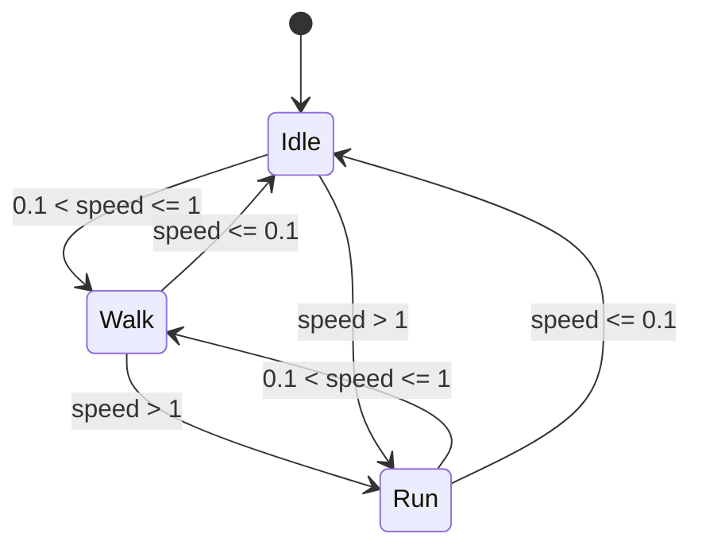

# Phase 3.8.5.2 Avatar Resource Production Report

状态：**PASS，Minecraft Avatar Resource v1 已生产并验证。** 日期：2026-10-04。

本阶段产物是真实 Unity Mesh、Skeleton、Skin Materials、AnimationClip、AnimatorController、Prefab 与 Windows AssetBundle。JSON/OBJ 是可复现的制作源，不冒充 Unity 原生资源。未实现 Avatar Renderer Runtime、Entity 接入、Network 同步、Equipment 绑定或 7DTD 代理替换。

## 1. 验收结果

| 必须项 | 结果 | 验证依据 |
|---|---|---|
| Avatar Mesh Load | PASS | Editor 与当前 7DTD 均加载 12 个带蒙皮 Mesh：六部件 × 两层 |
| Base Layer | PASS | 实际渲染基础层；六部件、64×64 UV 检查通过 |
| Layer2 | PASS | 外层图像与基础层产生像素差异；全透明外层与无外层图像完全相同 |
| Bone Hierarchy | PASS | 七个公共节点与 19 个内部骨骼；父子顺序、约束来源、Humanoid Avatar 有效性检查 |
| Idle | PASS | 真实 Controller 状态检查与 Mesh 顶点变化 |
| Walk | PASS | 真实 Controller 状态检查与 Mesh 顶点变化 |
| Run | PASS | 真实 Controller 状态检查与 Mesh 顶点变化 |
| Prefab Load | PASS | Editor 原生 Prefab、AssetBundle Prefab、当前 7DTD Bundle Prefab 加载成功 |
| Equipment Renderer Compatibility | PASS，限定范围 | 现有 Minecraft RendererHarness 38 项通过；资源具有公共 head 与内部 hand 节点。本轮没有跨端装备挂载验收 |

附加验证：25 项 Unity Editor 检查、10 项当前 7DTD 资源加载检查、90 项资源契约/证据检查通过。Java 12 个 Harness 合计 261 项通过，覆盖资源配置、Renderer、Equipment、Health、Identity、Presentation 与既有代理/调试行为。Minecraft Gradle build PASS；独立资源验证 Mod 编译 PASS，0 警告/0 错误。Bridge 与正式 7DTD Mod 未修改、未重新编译。

Unity Editor：2022.3.62f3c1，Windows build support。目标 7DTD：V3.2.0 b10 / Unity 2022.3.62f2。尽管 Editor patch 版本不同，本轮已经实测当前目标引擎的 Bundle、Avatar、Shader 与 Controller 加载，不仅是 Editor 内验证。

Bundle SHA256：`7D703898E4D32E8D4488DD095929A2D84956EDD72BD0E1A7711927F9D685C557`。目标引擎加载副本的 SHA256 与正式资源一致。

## 2. 资源目录结构

```text
assets/avatar/
├── README.md
├── avatar_config.json
├── avatar_config.schema.json
├── resource_manifest.json
├── skins/player_default.png
├── models/minecraft_avatar_v1/
│   ├── manifest.json
│   ├── Head_base.mesh.json / Head_base.obj
│   ├── Head_layer2.mesh.json / Head_layer2.obj
│   └── Body、Arm_L、Arm_R、Leg_L、Leg_R 的同类双层源文件
├── skeletons/minecraft_avatar_v1.json
├── animations/
│   ├── Idle.clip.json
│   ├── Walk.clip.json
│   ├── Run.clip.json
│   └── MinecraftAvatarAnimator.source.json
├── materials/minecraft_skin_materials.json
├── prefabs/MinecraftAvatarPrefab.source.json
├── bundles/windows/
│   ├── minecraft_avatar_v1
│   └── Bundle manifest 文件
└── production_unity/
    ├── Assets/Avatar/Editor/       # 资源制作与验证代码，不编入游戏 Bundle
    ├── Assets/Avatar/Source/player_default.png
    ├── Assets/Avatar/Shaders/AvatarSkin.shader
    ├── Assets/Avatar/Generated/
    │   ├── 十二个 Mesh .asset
    │   ├── MinecraftAvatarHumanoid.asset
    │   ├── MinecraftAvatarGeneric.asset
    │   ├── MinecraftSkinBase.mat
    │   ├── MinecraftSkinLayer2.mat
    │   ├── Idle.anim / Walk.anim / Run.anim
    │   ├── MinecraftAvatarAnimator.controller
    │   └── MinecraftAvatarPrefab.prefab
    ├── Packages/
    └── ProjectSettings/
```

原 Phase 3.8.5.1 Prototype 保留，没有替换其源代码；Library/Temp/Logs/UserSettings 缓存被忽略，也不进入交付包。

默认配置：

```json
{
  "avatar_id":"minecraft_alex_default",
  "model":"minecraft_humanoid",
  "variant":"alex_slim",
  "skin":"skins/player_default.png",
  "skeleton":"minecraft_avatar_v1"
}
```

只扩展独立资源配置读取器 AvatarResources；旧四字段配置的 skeleton 默认归一化为 minecraft_avatar_v1。没有改动 Renderer 接口、组件事实数据、revision 或网络消息。新 schema 校验正式五字段配置。当前生产资源只提供 alex_slim；旧 steve_classic 标识的读取兼容不代表已制作 Steve 模型。

## 3. Mesh 与 Skeleton 说明

全部比例以 Minecraft 像素尺寸定义，每像素 1/16 本地单位。Head 8×8×8、Body 8×12×4、左右 Arm 3×12×4、左右 Leg 4×12×4；基础模型总高 2 单位。矩形面独立 UV 顶点、平面法线，保持方块风格。尺寸与外层 UV/膨胀规则参考 [Mojang 官方 humanoid/slim 样例](https://github.com/Mojang/bedrock-samples/blob/main/resource_pack/models/mobs.json)，没有采用 7DTD 人体外形。

用户确认采用七个公共节点与内部 Humanoid 辅助骨架，结构为：

```text
AvatarRoot (Animator)
├── root
│   ├── body
│   ├── head
│   ├── arm_left
│   ├── arm_right
│   ├── leg_left
│   └── leg_right
├── InternalRig
│   └── rig_hips
│       ├── rig_spine → rig_chest → rig_neck → rig_head
│       │                  ├── rig_shoulder_left → rig_arm_left_upper
│       │                  │                         → rig_arm_left_lower → rig_hand_left
│       │                  └── rig_shoulder_right → rig_arm_right_upper
│       │                                            → rig_arm_right_lower → rig_hand_right
│       ├── rig_leg_left_upper → rig_leg_left_lower → rig_foot_left
│       └── rig_leg_right_upper → rig_leg_right_lower → rig_foot_right
├── Body
├── Head
├── Arm_L
├── Arm_R
├── Leg_L
└── Leg_R
```

六个大写视觉节点各有 BaseLayer 与 Layer2 SkinnedMeshRenderer。两个 Mesh 层绑定同一个内部骨骼，合计 288 顶点、144 三角形。每个身体块刚性绑定一个骨骼，保持 Minecraft 块状肢体；内部膝肘辅助节点目前不造成肢体弯折。

小写公共节点是稳定的骨架/挂点接口：通过 Unity ParentConstraint 追随对应内部骨骼，不参与 Mesh 顶点蒙皮，不与内部骨骼构成两个互相独立的动画系统。root 对应整个 Avatar 的局部原点，六个公共节点是其直接子节点。内部骨骼采用 T-pose 绑定；导出的 Humanoid Avatar 实测 isValid=True、isHuman=True。

未来头部挂点可读取 root/head；手部挂点可使用 rig_hand_left/right。这里只准备节点，没有创建装备对象、修改 Equipment 或实现 Renderer 挂载逻辑。

## 4. Skin Layer 说明

输入保留原 64×64 player_default.png，未绘制或转换用户皮肤。资源目录默认 PNG 与 Unity Source PNG 的 SHA256 相同：`D09B5B5F06B1056229604C363CE539D9BABF9CEA2F49DBE3718E99E6245085EC`。

下表为各 cuboid UV 的左上像素起点；由尺寸规则派生六个面，而不是把一整张 PNG 贴到方块上。

| 部件 | Base 起点 | Layer2 起点 | 单面向外膨胀 |
|---|---|---|---|
| Head / hat | 0,0 | 32,0 | 0.5 像素 |
| Body / jacket | 16,16 | 16,32 | 0.25 像素 |
| Arm_L / left sleeve | 32,48 | 48,48 | 0.25 像素 |
| Arm_R / right sleeve | 40,16 | 40,32 | 0.25 像素 |
| Leg_L / left pants | 16,48 | 0,48 | 0.25 像素 |
| Leg_R / right pants | 0,16 | 0,32 | 0.25 像素 |

Point filtering、Clamp、无 mipmap、无有损压缩，保留像素边缘。外层是独立膨胀几何与透明裁切材质，透明像素不会遮住基础层；基础层与外层渲染队列分别为 2000/2450。本版 alpha cutout 不提供半透明混合。默认 PNG 六个外层区域均含有效皮肤像素，独立 UV 矩形检查通过。

渲染证据：base-layer.png 与 layer2.png；alpha-baseline.png 与 alpha-transparent.png 完全一致，证明全透明外层没有变成黑色/不透明遮挡。Idle/Walk/Run 图片均已目视检查，脸部、衣服、袖口与裤腿外层可见。

## 5. Animator 说明

正式资源名：MinecraftAvatarAnimator.controller。三个真实 .anim Clip 使用内部骨骼 Transform 曲线，由 Controller 播放，已不再使用 Prototype 的 IAnimationJob 来代替正式基础动画资源。Controller 制作使用 [Unity AnimatorController 官方 API](https://docs.unity3d.com/2022.3/Documentation/ScriptReference/Animations.AnimatorController.html)。



speed 为 float，默认 0。Idle 周期 2 秒、Walk 周期 1 秒、Run 周期 0.6 秒；Walk/Run 肢体摆动幅度分别为 25°/45°。所有动画循环、关闭 root motion。转场不等待 Exit Time，固定混合时间 0.08 秒，支持加速、减速及直接从静止进入 Run。

Unity 条件只有严格 Greater/Less，因此制作工具用 float32 的下一个可表示值处理闭区间边界；实测 speed=0.1 为 Idle、speed=1 为 Walk。状态与真实 Mesh 位移都检查，避免仅凭参数或 Inspector 推断动画成功。

Editor 内采样平均顶点位移：Idle 0.005569472、Walk 0.1297726、Run 0.3183346。当前 7DTD 也实际执行 Controller 状态切换并通过。

**默认 Animator.avatar 是 MinecraftAvatarGeneric，Controller 使用 Generic Transform 动画。** MinecraftAvatarHumanoid 是同一内部骨架的独立有效 Humanoid Avatar，随 Bundle 导出，为以后 Humanoid 动画资源准备。本轮没有制作可重定向的 Humanoid muscle Clip，没有将 Generic Clip 标成 Humanoid，也没有复用 7DTD 原生 Controller。更换为 Humanoid Avatar 前必须另行配套、验证 Humanoid 动画，不能只换 Avatar 引用。

## 6. 测试范围与环境恢复

- Editor 生成、渲染、动画状态/顶点采样、Bundle 构建和重新加载通过。
- 独立 tests/avatar-resource-smoke 仅加载资源，不进入世界、不读取游戏玩家、不注册 Entity，不实现 Avatar Renderer；加载后自动退出。
- 7DTD 同时扫描安装目录，测试期间临时禁用全局 Bridge ModInfo；日志确认该 Mod 未加载。测试进程已退出，原 ModInfo 已恢复，禁用备份不存在。
- Java AvatarResources 新 skeleton 解析、旧配置兼容、缺失/损坏皮肤 fallback 通过；现有 Renderer、Equipment、Health、Identity、Presentation 相关 Harness 通过。
- 没有验证已同步代理外观、世界足底位置、挂载装备、远程皮肤、动画同步、多人性能或长期资源释放；这些都不是本阶段 PASS 的含义。

## 7. Runtime 接入计划（未执行）

1. 实现本地 AvatarState / 资源解析器，以 manifest、skeleton id、variant 与受控相对 PNG 路径选择资源；保留默认资源 fallback。
2. 建立 AvatarRenderer 的 create/update/remove 与材质实例、贴图缓存、Bundle 引用计数。加载本轮 Prefab，替换本地皮肤材质实例，不改事实 Component。
3. 校准 AvatarRoot 的世界坐标、整体缩放、朝向和足底位置；Renderer 只使用 AvatarState，不直接读取网络 Equipment。
4. 根据本地派生运动状态驱动有限 speed 参数；验证 Idle/Walk/Run 切换、退出重进和断连清理，不默认启用 root motion。
5. 后续单独对接 Anchor Provider 和 Equipment Renderer；对 hand/head 节点执行独立挂点验收。再考虑 Humanoid animation、攻击与表情资源。

以上仅为计划。本阶段完成后停止，没有创建上述 Runtime，也未进入下一阶段。

## 8. 修改与复现

新增：assets/avatar 下正式资源、制作工程、README 与 manifest；tests/produce-avatar-resources.py、build-phase3_8_5_2.ps1、validate-phase3_8_5_2.py、verify-phase3_8_5_2-game.ps1 与独立资源 Smoke Mod；本文档。

修改：avatar_config.json、avatar_config.schema.json、独立 Java AvatarResources 配置解析与 AvatarResourcesHarness。Entity Protocol、Bridge、Authority、Equipment Component、Presentation Component、现有 Renderer Runtime 与正式 7DTD 采集器均未修改。

在 D:\wenjian\minecraft\7-M 执行：

```powershell
./tests/build-phase3_8_5_2.ps1
./tests/verify-phase3_8_5_2-game.ps1
./tests/run-phase3_8_4_1.ps1
& 'C:/Users/qin_roupl/.cache/codex-runtimes/codex-primary-runtime/dependencies/python/python.exe' tests/validate-phase3_8_5_2.py
```

制作工具要求已激活 Unity Editor 与 Windows build support；可通过 -UnityEditor 指定安装位置。验证 Python 需要 Pillow，现有 Codex bundled Python 已包含。正常测试不要中断游戏验证启动器；如果强制中断，按 assets/avatar/README.md 恢复全局 ModInfo。
