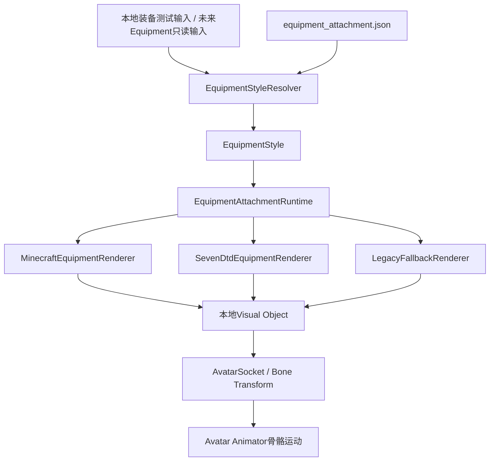

# Phase 3.9.0 Multi Style Renderer Design Report

## 实施边界

用户已确认按本地挂载范围完成。Avatar位于7DTD端，Minecraft ItemDisplay位于Minecraft端；两者不能跨引擎直接挂接。本阶段将Style、Socket、EquipmentAttachment全部实现为7DTD本地派生表现层，使用已有debug本地输入验证。没有把Minecraft→7DTD装备同步写成已完成。

## 数据流

EquipmentStyle字段：item_id、source_game、style、renderer、model、socket。Resolver按完整ID查配置，source_game作为配置元数据保留；Renderer注册表只通过renderer键选择实现。Renderer只接收model，不解析物品ID或游戏来源，不用前缀分支识别风格。

接口：`IEquipmentVisualRenderer.Id`、`Create(model)`；`EquipmentAttachmentRuntime.Update(root,item)`、`Remove()`、`Inspect()`、`Register(renderer)`；`AvatarSocket.Resolve(root)`、`Attach(visual,bone)`。

## 风格资源

- minecraft_renderer：本地程序化测试资源，青色体素剑；配置物品minecraft:diamond_sword，style=blocky。
- 7dtd_renderer：本地程序化测试资源，圆柱木柄与灰色斧头；配置物品7dtd:iron_axe（兼容7dtd:ironAxe），style=realistic。
- legacy_fallback：黄色Block Marker。未知ID、Renderer键缺失、模型不支持或创建失败时回退；没有可用挂点时不创建漂浮对象。

这些是风格／挂载基础测试资产，不是Minecraft原生ItemDisplay，也不是已加载的7DTD原生铁斧Mesh。后续可通过注册Renderer与model映射接入真实资源，不修改网络。

Minecraft已有ItemDisplay与BlockDisplay保持原状；它们仍是Minecraft侧兼容／fallback路径，未删除，也未搬到Unity运行。本阶段新增Unity侧LegacyFallbackRenderer。

## Socket合同

| socket | 实际骨骼 | 用途 |
|---|---|---|
| right_hand | rig_hand_right | 第一版held装备 |
| left_hand | rig_hand_left | 预留并自动验证绑定 |
| head | rig_head | 预留并自动验证绑定 |
| back | rig_chest | 预留并自动验证绑定 |

每个Socket配置bone、offset(x/y/z)、rotation(x/y/z，度)、scale正数。Visual以SetParent(bone,false)挂接，设置本地Transform，由Unity骨骼层级自然继承Idle／Walk／Run／Jump／Fall；不每帧重新设置世界位置，不控制Animator，不修改事实Transform。

固定Socket名称，不自动猜骨骼。配置读取时限制长度、拒绝重复字段、拒绝非法Socket、非有限向量与非法scale；失败使用安全fallback。配置在Renderer创建时加载，修改后重启7DTD，不支持热加载。

## 生命周期与容量

每个Avatar的本地held适配器管理一个装备实例。Update相同item且挂点相同时保持实例；替换先移除旧实例，再创建／绑定新实例；null移除。不同Avatar可同时使用不同Renderer。四Socket已能解析／绑定，但尚未实现单Avatar多槽装备管理或双持事实输入。

Remove使旧Visual立即inactive，Unity延迟销毁GameObject，释放私有Material；Avatar Remove、Disconnect、World Change复用既有清理路径。重新Spawn创建新的挂载Runtime；本地测试装备不会自动持久化或联网重放，重连后需再次提供本地输入。

Inspector `equipment_attachment`显示item_id、source_game、style、renderer、socket、attached、reason、config_status、input=local_test。attached验证实际父子关系，区别于仅存在映射。

## 风险与后续接口

真实原生资源的模型比例、朝向、材质、授权与加载生命周期尚未验证；当前Socket偏移按测试资产校准。模型替换需继续验证相交、镜像手与动画。缺失骨骼返回socket_missing；Fallback材质也失败时返回fallback_unavailable，保持Avatar同步运行。

Entity Protocol、Authority、Revision、Bridge与Equipment／Presentation协议均不变。没有动作协议、Combat、Inventory、攻击或武器挥舞。下一阶段尚未开始。
