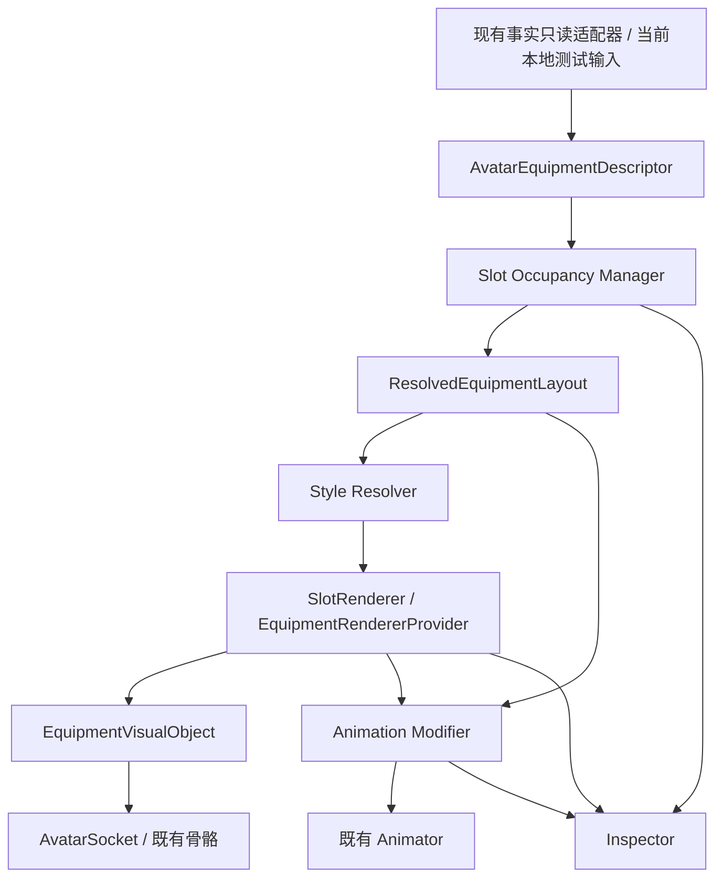

# Phase 3.9.2.0 Avatar Equipment Expansion Design v1

日期：2026-10-04。状态：设计完成，Runtime 未实施。

## 范围与现状校正

本方案设计 7DTD 世界中 Minecraft Avatar 的完整本地装备表现层，不修改 Entity／Equipment 协议、Authority、Bridge 或 Component revision，不进入 Combat。

经核对，Phase 3.9.1 已经实现六槽独立挂载、三种 Renderer、空槽 Inspector、清理与持物 Walk／Run Override。因此本阶段不是重新建立六槽，而是补齐装备分类、双手占用、冲突决策、Socket 镜像规范、SlotRenderer 协调与细分动画接口。

现有事实 Equipment Component 的槽位是 head、body、hands、feet、held_item。hands 表示手部护甲，不是 left_hand；不能改名或映射成副手。新视觉六槽不增加网络字段。

Minecraft→7DTD 当前没有玩家装备数据。沿用已授权的 7DTD 本地测试输入。已有 EquipmentVisualState 属于另一方向的 Minecraft 本地派生路径，不假设它已经存在于 7DTD Avatar 输入中。未来可以增加只读输入适配器，但需另行明确实际数据来源。

## 架构与数据流



事实不可变；Descriptor、占用布局、Style、动画 Profile 均为本地派生。Renderer 不依据游戏名称或物品 ID 前缀选择实现，而依据显式映射的 renderer 键。

## 本地数据结构

下面是设计示例，不是新增 Component 或网络消息：

```json
{
  "entry_key": "local_test:right_hand:rifle",
  "item_id": "7dtd:rifle",
  "source_game": "7dtd",
  "style": "realistic",
  "category": "weapon",
  "kind": "two_hand",
  "requested_slot": "right_hand",
  "primary_slot": "right_hand",
  "occupied_slots": ["right_hand", "left_hand"],
  "renderer": "realistic",
  "model": "rifle",
  "animation_profile": "two_hand"
}
```

entry_key 由输入适配器的稳定条目键产生，不包含帧时间，不替代 entity_id。category、kind、occupied_slots 来自可信本地映射；未知物品只能保守占用请求的一个槽，不能猜测双手属性。

ResolvedEquipmentLayout 包含六槽的 owner／reservation、accepted_entries、suppressed_entries、原因。VisualBinding 单独记录实际 Renderer、骨骼、对象与状态，避免把“布局成功”当成“显示成功”。本地 session token 仅隔离世界和旧对象，不新增或发送 revision。

## 装备分类

| Category | 类型示例 | 默认槽 | 动画需求 | Renderer |
|---|---|---|---|---|
| Weapon | 单手／双手／盾牌 | right_hand／双手／left_hand | 单手、双手、盾牌握持 | 显式配置，三风格均可 |
| Tool | 火把、镐、铲 | right_hand | 单手；大型工具可显式双手 | 显式配置 |
| Armor | 头盔、胸甲 | head／body | 不改变手部 Profile | 显式配置 |
| Backpack | 背包 | back | 不启用持物动画 | 显式配置 |
| Accessory | 腰包、挂件、帽饰 | waist；可配置 head | 通常不改变动画 | 显式配置 |

分类不决定游戏来源，也不强制某一种 Renderer。允许挂点集合由映射限定。大型武器配置为背部收纳时，仅占 back，不同时占双手。

## 实施边界

六槽“完整”指完整的管理与生命周期，不承诺刚性 body 对象已经能实现整套可变形服装。v1 body 是附着 torso 的护甲／装饰；完整 SkinnedMesh 衣物、遮挡 Skin Layer2、精确双手 IK 和原生 7DTD 武器资源加载属于后续独立资源任务。

Minecraft Style 在 7DTD 中由 Unity 对象模拟物品风格，不是跨引擎使用 Minecraft ItemDisplayEntity。Minecraft 端已有 ItemDisplay／BlockDisplay 保留为原有兼容路径；7DTD LegacyFallbackRenderer 保留本地 Marker 回退。

## 生命周期合同

| 事件 | 处理 |
|---|---|
| Spawn | 骨骼就绪后应用当前有效本地输入；没有装备输入时六槽为空 |
| Update | 重算占用布局，准备候选对象，提交后隐藏并销毁旧对象 |
| Remove | 释放整个装备条目的全部占用，包括双手 reservation |
| Despawn／Disconnect | 清空输入、占用、对象、动画 Override 和私有资源 |
| World Change | 隔离旧 session；旧回调不能挂到新 Avatar |
| Reconnect | 新骨骼重新绑定；不自动重播已销毁的本地测试装备 |

输入适配器区分完整快照、局部更新、明确 null 和数据未知；这只是本地输入合同。未知不等于空槽，不改变现有协议的缺省字段语义。相同有效输入重复应用必须幂等。

## Inspector

avatar_equipment 固定显示六槽，空槽 null。主槽显示 item_id、category、style、requested_renderer、实际 renderer、socket、resolved_bone、attached、active、status、reason。副槽被双手武器占用时显示 reservation，不能显示为 null 或第二把武器。

```json
{
  "avatar_equipment": {
    "right_hand": {"item":"rifle","category":"weapon","renderer":"realistic","socket":"right_hand","attached":true,"active":true,"status":"active"},
    "left_hand": {"status":"reserved","owner_slot":"right_hand","renderer":null,"active":false},
    "head": null,
    "body": null,
    "back": {"item":"backpack","category":"backpack","renderer":"voxel","socket":"back","active":true,"status":"active"},
    "waist": null
  },
  "animation_profile":"two_hand",
  "suppressed_entries": []
}
```

保留原 equipment_attachment 右手兼容视图。suppressed、fallback、unavailable 分别表示冲突、视觉回退和无法绑定，不能统一写 active。

## 风险与后续实施顺序

主要风险：公共骨骼名与内部节点混淆、左手镜像反转法线、双手竞争导致对象残留、共享材质被误销毁、切换 Override 破坏 Jump 状态、刚性护甲穿模，以及实际跨端装备输入尚不存在。

建议后续按四个可验收增量实施：本地 Descriptor／Occupancy 纯逻辑；SlotRenderer 事务与六槽绑定；单手／双手动画资源与接口；实机多槽／冲突／清理验收。此处仅规划，没有启动 Phase 3.9.2.1。

实施前需确认的产品选择：双手与盾牌的优先级是否采用本方案默认值；第一批左手镜像模型是否提供；body 是否接受刚性护甲边界。当前设计采用下面专项文档的默认规则，不阻塞设计交付。

## 配套文档

- [Slot System](Slot_System_Proposal.md)
- [Renderer Extension](Renderer_Extension_Proposal.md)
- [Animation Integration](Animation_Integration_Proposal.md)
- [测试计划](Test_Plan.md)
