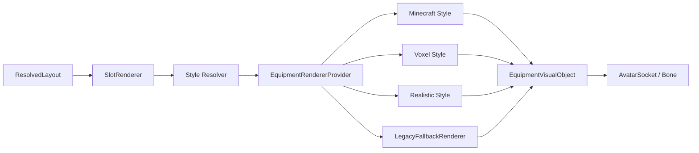

# Renderer Extension Proposal — Phase 3.9.2.0

状态：接口与生命周期设计，不实现 Runtime。

## 复用现有能力

EquipmentRendererProvider 已支持显式选择 minecraft／voxel／realistic、旧 Minecraft／7DTD Renderer 和 LegacyFallbackRenderer。EquipmentVisualObject 已提供 Update、Attach、Detach、Destroy；Create 由 Provider 完成。本阶段不删除或重新实现这些能力。

新增 SlotRenderer 是每个 Avatar 的协调层，负责把 Occupancy 布局变成真实绑定状态。Provider 负责选择实现，VisualObject 负责对象资源；三者不互相替代。



## 统一接口草案

```csharp
// 文档接口；可采用现有类型的适配器，避免破坏旧调用。
interface ISlotRenderer {
    ReconcileResult Reconcile(ResolvedLayout layout, AvatarBindingContext avatar);
    IReadOnlyList<VisualBindingState> Inspect();
    void RemoveEntry(string entryKey);
    void Clear();
}
interface IEquipmentVisualRenderer {
    string Id { get; }
    EquipmentVisualObject Create(VisualSpec spec);
}
// EquipmentVisualObject: Update / Attach / Detach / Destroy
```

现有 Renderer.Create(model) 可以由 VisualSpec.model 适配，不必一次改完所有旧实现。VisualSpec 描述模型、风格、材质需求、握持修正和镜像资源；不携带 Authority 或网络写入接口。

## 风格与 Mapping

| 风格 | 7DTD 中实现 | 边界 |
|---|---|---|
| Minecraft | Unity 物品卡片／方块风格资源 | 不是 Minecraft 原生 ItemDisplayEntity |
| Voxel | 方块组合模型 | 避免每个方块独立高成本材质 |
| Realistic | Unity Mesh／Material | 当前测试 Mesh 不等于已加载原生 7DTD 武器 |
| Legacy Fallback | 现有本地 Marker | 未知映射／资源失败仍可观察 |

配置按完整 item_id 显式填写 source_game、style、category、renderer、model 和槽位规则。禁止由前缀推断来源；同一物品可以配置不同风格。现有配置保持兼容，新增字段缺失时采用保守单槽规则。

模型范围延续木棒、斧、手枪、步枪、火把、镐、铲及头盔／背包测试资源。新增 waist 装饰、盾牌、双手握持模型需要独立资源验收，不能仅因配置存在就宣称模型已完成。

## Reconcile 事务

1. Resolve：取得布局、Socket 与映射，识别保留／更新／替换／移除。
2. Prepare：新对象保持隐藏；验证资源与骨骼，必要时创建 fallback。旧对象暂不修改。
3. Commit：在 Unity 主线程提交布局与绑定，先隐藏旧对象，再挂载并激活新对象。reservation 不创建对象。
4. Retire：Destroy 旧对象和失败候选，刷新实际 Inspector 状态及动画 Profile。

同一 item、映射、Socket 与有效骨骼引用不变时，Update 偏移即可；模型、Renderer 或镜像资源变化需 Replace。新 Avatar 使用相同 entity_id 也不能复用旧骨骼引用。

当前设计优先同步主线程流程。若后续引入异步加载，必须检查本地 Avatar session／binding token，迟到结果只释放资源，不回挂到已销毁实体。这不是网络 revision。

本地装备事务 Prepare 失败允许保留旧对象；只读事实已变化则清除过期对象并报告 unavailable。不能用旧斧头冒充新的无资源步枪。

## Fallback 矩阵

| 情况 | 结果 |
|---|---|
| 映射缺失／未知模型／Renderer失败 | Legacy Marker，status=fallback，记录具体 reason |
| 镜像资源缺失 | 不使用负 scale；Marker fallback，reason=mirror_unsupported |
| Shader／材质不支持 | 尝试已验证 fallback 材质／Marker |
| Socket／骨骼缺失 | status=unavailable，不创建浮空对象 |
| fallback 也创建失败 | 清理候选，unavailable；不阻断 Entity 同步 |
| 配置非法 | 保留最近有效配置；没有有效配置时安全默认或无显示 |

Inspector 必须同时报告 requested_renderer 和实际 renderer，不能把 fallback 写成 realistic 成功。active 需要真实对象有效、启用且父节点匹配。

## 资源所有权与稳定性

每个装备条目拥有一个对象；六槽共享占用布局，但不共享可变实例。私有 Mesh／Material／AnimatorOverride 由创建者释放；借用 AssetBundle 资源通过引用计数／资源租约管理，不能随对象销毁随意 Destroy 公用资源。

Detach 立即隐藏并脱离骨骼；Unity 延迟 Destroy 不应产生一帧残影。Clear 重复调用安全。多个 Avatar 的同款装备不得互相清理。缓存不得持有已销毁世界的 Transform。

body v1 为刚性 torso 附件，不实现全身换装、SkinnedMesh 重绑定、Skin／Layer2 覆盖遮罩。head 必须随现有 Head Pitch；手部随骨骼动画；back／waist 随 torso。Renderer 不直接设置 Entity Position 或 Avatar Head Transform。

## Inspector 生命周期

创建准备中可记录 pending，但不会显示 active。提交后为 active 或 fallback；冲突为 suppressed；副槽为 reserved；空槽 null；失败为 unavailable。Despawn 后 Inspector 不应留下旧绑定。

详见 [Slot 规范](Slot_System_Proposal.md)、[动画方案](Animation_Integration_Proposal.md)、[测试计划](Test_Plan.md)。
